# VGG16 CNN model


```python
%%capture --no-stdout

import numpy as np
import matplotlib.pyplot as plt
from matplotlib import cm
from glob import glob
from tqdm import tnrange
from shutil import copyfile
from keras import models
from keras.applications.vgg16 import VGG16, decode_predictions, preprocess_input
from keras.preprocessing import image

model = VGG16(weights='imagenet', include_top=True)
print('Architecture:')
model.summary()
```

    Architecture:
    _________________________________________________________________
    Layer (type)                 Output Shape              Param #   
    =================================================================
    input_1 (InputLayer)         (None, 224, 224, 3)       0         
    _________________________________________________________________
    block1_conv1 (Conv2D)        (None, 224, 224, 64)      1792      
    _________________________________________________________________
    block1_conv2 (Conv2D)        (None, 224, 224, 64)      36928     
    _________________________________________________________________
    block1_pool (MaxPooling2D)   (None, 112, 112, 64)      0         
    _________________________________________________________________
    block2_conv1 (Conv2D)        (None, 112, 112, 128)     73856     
    _________________________________________________________________
    block2_conv2 (Conv2D)        (None, 112, 112, 128)     147584    
    _________________________________________________________________
    block2_pool (MaxPooling2D)   (None, 56, 56, 128)       0         
    _________________________________________________________________
    block3_conv1 (Conv2D)        (None, 56, 56, 256)       295168    
    _________________________________________________________________
    block3_conv2 (Conv2D)        (None, 56, 56, 256)       590080    
    _________________________________________________________________
    block3_conv3 (Conv2D)        (None, 56, 56, 256)       590080    
    _________________________________________________________________
    block3_pool (MaxPooling2D)   (None, 28, 28, 256)       0         
    _________________________________________________________________
    block4_conv1 (Conv2D)        (None, 28, 28, 512)       1180160   
    _________________________________________________________________
    block4_conv2 (Conv2D)        (None, 28, 28, 512)       2359808   
    _________________________________________________________________
    block4_conv3 (Conv2D)        (None, 28, 28, 512)       2359808   
    _________________________________________________________________
    block4_pool (MaxPooling2D)   (None, 14, 14, 512)       0         
    _________________________________________________________________
    block5_conv1 (Conv2D)        (None, 14, 14, 512)       2359808   
    _________________________________________________________________
    block5_conv2 (Conv2D)        (None, 14, 14, 512)       2359808   
    _________________________________________________________________
    block5_conv3 (Conv2D)        (None, 14, 14, 512)       2359808   
    _________________________________________________________________
    block5_pool (MaxPooling2D)   (None, 7, 7, 512)         0         
    _________________________________________________________________
    flatten (Flatten)            (None, 25088)             0         
    _________________________________________________________________
    fc1 (Dense)                  (None, 4096)              102764544 
    _________________________________________________________________
    fc2 (Dense)                  (None, 4096)              16781312  
    _________________________________________________________________
    predictions (Dense)          (None, 1000)              4097000   
    =================================================================
    Total params: 138,357,544
    Trainable params: 138,357,544
    Non-trainable params: 0
    _________________________________________________________________


## Model classifies (normal) test images successfully


```python
def load_and_preprocess_images(folder_path):
    images = glob(folder_path)
    names = []
    img_set = np.zeros((len(images), 224, 224, 3))
    for i in range(len(images)):
        img_set[i] = image.load_img(images[i], target_size=(224, 224))
        img_set[i] = image.img_to_array(img_set[i])
        img_set[i] = preprocess_input(img_set[i])
    return img_set
```


```python
images = glob('../data/other_images/*')
test_names = []
img_set = np.zeros((len(images), 224, 224, 3))
for i in range(min(20, len(images))):
    img_set[i] = image.load_img(images[i], target_size=(224, 224))
    img_set[i] = image.img_to_array(img_set[i])
    img_set[i] = preprocess_input(img_set[i])
preds = decode_predictions(model.predict(img_set))
plt.figure(figsize=(3*len(images), 3))
for i in range(len(images)):
    plt.subplot(1, len(images), i+1)
    plt.imshow(image.array_to_img(img_set[i]))
    plt.title('%s (%.2f)'%(preds[i][0][1], preds[i][0][2]))
    plt.setp(plt.gca(), xticks=[], yticks=[])
    test_names.append(preds[i][0][1])
plt.tight_layout()
```


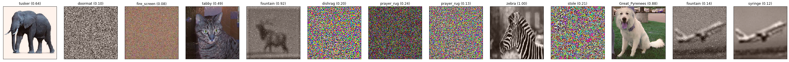


## What layers in the model do we care about? Using all layers...

What layers do I choose? Starting with all layers for now, to see how each works.


```python
layers = model.layers[1:] # can choose specific layers here if all of them are not very useful
layer_names = [layer.name for layer in layers]
activation_model = models.Model(inputs=model.input, outputs=[layer.output for layer in layers])
activations = activation_model.predict(img_set)
```

## Subsampling units


```python
def sample_units(n, geometry, center=None, radius=None, unit_type='random'):
    '''
    Returns a random subsample of units from among all
    n: number of units to subsample per image
    geometry: tuple (# images, space_x, space_y, depth) or int (for flat fully connected layers)
    center: tuple (x, y), the center of a visual area to sample around, NOT IMPLEMENTED
    radius: in pixels to sample from, NOT IMPLEMENTED
    unit_type: one of 'random' (random units), 'equal' (equal number of units of each type), int (units of a particular type)
    '''
    if type(geometry) == int:
        mask = np.zeros(geometry)
        mask[np.random.choice(geometry, size=n, replace=False)] = 1
        return np.array(mask, dtype=int)
    if unit_type == 'equal':
        mask = np.zeros(geometry)
        for j in range(geometry[0]):
            for i in range(geometry[3]):
                units = np.random.choice(geometry[1]*geometry[2], size=int(n/geometry[3]), replace=False)
                _mask = np.zeros((geometry[1]*geometry[2]))
                _mask[units] = 1
                mask[j, :, :, i] = _mask.reshape((geometry[1], geometry[2]))
        return np.array(mask, dtype=int)
    else:
        mask = np.zeros(geometry)
        for i in range(geometry[0]):
            _mask = np.zeros(np.prod(geometry[1:]))
            _mask[np.random.choice(np.prod(geometry[1:]), size=n, replace=False)] = 1
            mask[i] = _mask.reshape(geometry[1:])
        return np.array(mask, dtype=int)
    
def get_sampled_activations(n_units, activations):
    units, sampled_activations = [], []
    for layer in range(len(activations)):
        units.append(sample_units(n_units, activations[layer].shape, unit_type='random'))
        sampled_activations.append(activations[layer][np.nonzero(units[-1])].reshape((activations[layer].shape[0], n_units)))
    return units, sampled_activations
```


```python
n_units = 200
units, sampled_activations = get_sampled_activations(200, activations)
```

### Activations in randomly selected units for test images


```python
layer = -2
plt.figure(figsize=(16, 3))
for i in range(sampled_activations[layer].shape[0]):
    plt.bar(np.arange(n_units)+i*1./sampled_activations[layer].shape[0], sampled_activations[layer][i],
            1./sampled_activations[layer].shape[0], align='edge', label='%s'%(test_names[i]))
plt.xlabel('Unit #')
plt.ylabel('Activation')
plt.legend(loc=(1.01, 0))
plt.title("Activations from %d randomly selected units in layer '%s'"%(n_units, layer_names[layer]));
```


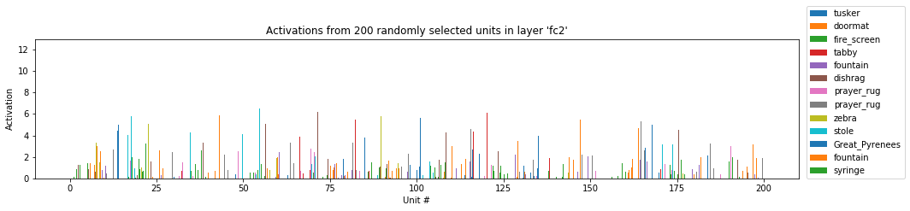


```python
layer = 4
plt.figure(figsize=(16, 3))
for i in range(sampled_activations[layer].shape[0]):
    plt.bar(np.arange(n_units)+i*1./sampled_activations[layer].shape[0], sampled_activations[layer][i],
            1./sampled_activations[layer].shape[0], align='edge', label='%s'%(test_names[i]))
plt.xlabel('Unit #')
plt.ylabel('Activation')
plt.legend(loc=(1.01, 0))
plt.title("Activations from %d randomly selected units in layer '%s'"%(n_units, layer_names[layer]));
```


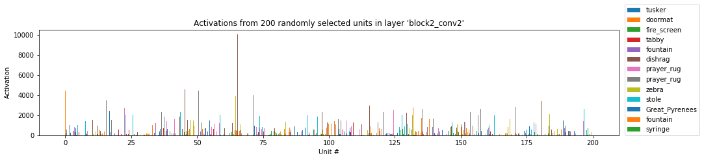


Note the big difference in mean activation level in different layers (in the penultimate layer, top panel, activations are three orders of magnitude lower than in layer 4, bottom panel). Thus, it is necessary to normalize activations in each layer before their differences can be compared across layers.

### Distance between activations for image pairs

As noted above, we normalize the activation in each layer before computing any distances, so that we can compare across layers.

Below, I compute the distance in activation space for all image pairs. I simply use the Euclidean distance as the metric: $d_{i,j} = \sqrt{(r_i-r_j)*(r_i-r_j)}$


```python
def compute_rdm(activations, norm=True):
    '''
    activations: list of activations by layer, each element in the list is of the shape (n_images, n_units)
    norm: bool, whether or not to normalize activations in each layer by mean activation
    '''
    diff_mats = np.zeros((len(activations), activations[0].shape[0], activations[0].shape[0]))
    for i in range(len(activations)):
        if norm:
            layer_activations = activations[i]/activations[i].mean()
        else:
            layer_activations = activations[i]
        n_samples = layer_activations.shape[0]
        for j in range(n_samples):
            for k in range(j+1, n_samples):
                diff_mats[i][j][k] = np.sqrt(sum((layer_activations[j]-layer_activations[k])*(layer_activations[j]-layer_activations[k])))
                diff_mats[i][k][j] = diff_mats[i][j][k]
    return diff_mats

def get_rdm_from_activations(n_units, activations, norm=True):
    units, sampled_activations = get_sampled_activations(n_units, activations)
    return compute_rdm(sampled_activations, norm)

def get_median_differentiation_from_activations(n_units, activations, norm=True):
    rdm = get_rdm_from_activations(n_units, activations, norm)
    return np.median(rdm, axis=(1, 2))
```


```python
rdm = compute_rdm(sampled_activations)
plt.figure(figsize=(16, 4))
for i in range(rdm.shape[1]):
    for j in range(i+1, rdm.shape[2]):
        plt.plot(rdm[:, i, j], '-o', label='%s vs %s'%(test_names[i], test_names[j]))
x = range(len(layers))
dif = [np.median(rdm[i]) for i in x]
plt.plot(x, dif, c='k', lw=3)
#plt.yscale('log')
plt.ylim(0, 120)
plt.setp(plt.gca(), xticks=range(len(layer_names)), xticklabels=layer_names)
plt.xticks(rotation=45)
#plt.legend(loc=(1.01, 0))
plt.xlabel('Layer -> increasing depth')
plt.ylabel('Distance in activation space');
```


### Median differentiation

The figure below shows the differentiation in response, where differentiation is defined as the median of the RDM matrix


```python
plt.figure(figsize=(8, 3))
x = range(len(layers))
dif = [np.median(rdm[i]) for i in x]
plt.plot(x, dif)
plt.xlabel('Layer')
plt.ylabel('Differentiation')
plt.setp(plt.gca(), xticks=range(len(layer_names)), xticklabels=layer_names)
plt.xticks(rotation=60)
plt.grid()
```


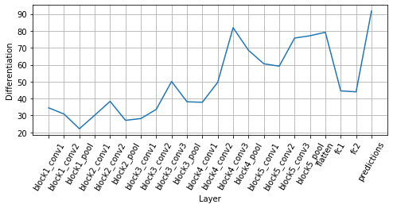


We see that the median differentiation increases with depth on average, although there are a few dips. Most dips occur at the pooling layers, which is expected because the network loses information due to downsampling at these layers.

Note also that differentiation is quite low in the fully connected layers. In CNNs, it is believed that the image representations are built up to the last convolutional layer, which is supposed to have most of the semantic information. The fully connected layers only act to use the encoded representations to form the final classes.

### Effect of sampling noise on differentiation

I now apply the procedure since subsampling multiple times to see how the sampling affects measured differentiation. The procedure is repeated 100 times and the mean and SD of differentiation is plotted.


```python
n_repeat, n_units = 100, 200
diffs = np.zeros((n_repeat, len(layers)))
for i in tnrange(n_repeat):
    diffs[i] = get_median_differentiation_from_activations(n_units, activations)
```


    HBox(children=(IntProgress(value=0), HTML(value='')))


    


```python
plt.figure(figsize=(8, 3))
plt.errorbar(range(len(layers)), diffs.mean(axis=0), diffs.std(axis=0));
plt.xlabel('Layer')
plt.ylabel('Differentiation')
plt.setp(plt.gca(), xticks=range(len(layer_names)), xticklabels=layer_names)
plt.xticks(rotation=60)
plt.legend()
plt.grid()
```

    W0805 15:05:36.569746 139846861276992 legend.py:1282] No handles with labels found to put in legend.


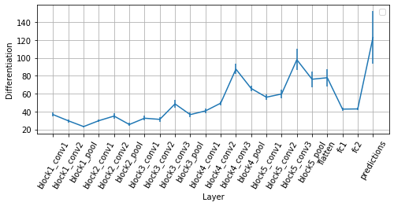


```python
diffs = {}
```

### Differentiation applied to random images


```python
n_units = 200
img_folder = '../data/random_images/*.jpg'
activations = activation_model.predict(load_and_preprocess_images(img_folder))
diffs['random'] = get_median_differentiation_from_activations(n_units, activations)
print('Loaded and processed %d images'%(activations[0].shape[0]))
```

    Loaded and processed 43 images


### Differentiation applied to a bunch of white noise images


```python
n_units = 200
img_folder = '../data/white_noise/*'
activations = activation_model.predict(load_and_preprocess_images(img_folder))
diffs['noise'] = get_median_differentiation_from_activations(n_units, activations)
print('Loaded and processed %d images'%(activations[0].shape[0]))
```

    Loaded and processed 43 images


### Differentiation applied to a bunch of cats

The cat images used here are those that the pretrained VGG16 model classifies as 'tabby' with a probability of more than 50%. To change the image set, modify [Generate_adversarial.ipynb](Generate_adversarial.ipynb).


```python
n_units = 200
img_folder = '../data/tabby_cats/*'
activations = activation_model.predict(load_and_preprocess_images(img_folder))
diffs['tabby'] = get_median_differentiation_from_activations(n_units, activations)
print('Loaded and processed %d images'%activations[0].shape[0])
```

    Loaded and processed 43 images


### Differentiation applied to a bunch of adversarial cats

The same set of images as above are used as the starting point. For each image, an adversarial image is created which misclassifies the image into categories other than cats. Differentiation is then computed and plotted for this set of adversarial images


```python

```

### Comparison of differention for different image sets


```python
plt.figure(figsize=(8, 3))
for key in diffs.keys():
    plt.plot(range(len(layers)), diffs[key], label=key)
plt.xlabel('Layer')
plt.ylabel('Differentiation')
plt.setp(plt.gca(), xticks=range(len(layer_names)), xticklabels=layer_names)
plt.xticks(rotation=60)
plt.legend()
plt.grid()
```


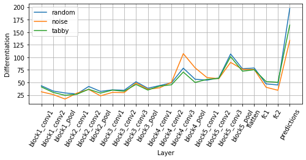


We would have expected since the higher layers encode abstract concepts from the image, they would show low differentiation in the 'tabby' set, probably low differentiation in the 'noise' set, and slightly higher differentiation in the 'random' set, since it contains the most distinct group of images. This might be somewhat true in block5_layer3 and the following pool and flatten. It is good to see this, although quite surprising that there is really only one convolutional layer that actually shows any differences.

Also, block4_conv3 shows the opposite pattern, and it is not at all clear why that is so. The final fully connected layers typically show less differentiation, which is also not obvious to explain.

What this does mean, however, is that if the images really don't matter so much, we might as well show the same movies that are shown to the mouse and get something out of it...

## What substrate do we use for differentiation? Mean filter activation

There are 224 x 224 x 3 x 9 x 64 'neurons' in the first convolution layer, and even more for later ones. It would be computationally slow to use all of them individually for computing differentiation. Moreover, these neurons are funny in the sense that there are only 27 x 64 independent weights, corresponding to 64 independent 'filters', each with a receptive field of 3 x 3. Thus, a reasonable approach might be to use the mean (over all spatial locations) activations in the 64 layers as the 'state vector' for computing differentiation. This is what is done below.

There might be other reasonable approaches to aggregating activations before computing differentiation such as:
1. Looking at all activations independently
2. Averaging the activations at a given spatial location (averaging over filters)
3. Simply subsampling a few units

### Distribution of mean filter activations for test images


```python
layer = 12
act1, act2, act3 = activations[layer][:3]
mact1, mact2, mact3 = act1.mean(axis=0).mean(axis=0), act2.mean(axis=0).mean(axis=0), act3.mean(axis=0).mean(axis=0)
plt.hist(mact1, label='Image 1', color=cm.Reds(0.7, 0.6), bins=20);
plt.hist(mact2, label='Image 2', color=cm.Greens(0.7, 0.6), bins=20);
plt.hist(mact3, label='Image 3', color=cm.Blues(0.7, 0.6), bins=20);
plt.legend()
plt.title('Distribution of mean activation of all %d filters in %s'%(layers[layer].output_shape[-1], layer_names[layer]));
plt.xlabel('Mean activation')
plt.ylabel('Frequency');
```


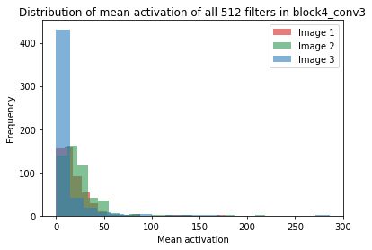


### Mean activations for test images


```python
plt.figure(figsize=(16, 3))
plt.bar(np.arange(mact1.shape[0]), mact1, 0.33, align='edge', label='Image 1')
plt.bar(np.arange(mact2.shape[0])+0.33, mact2, 0.33, align='edge', label='Image 2')
plt.bar(np.arange(mact3.shape[0])+0.66, mact3, 0.33, align='edge', label='Image 3')
plt.xlabel('Filter #')
plt.ylabel('Mean activation');
```


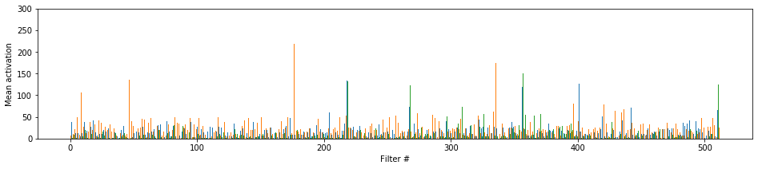


### Pairwise differences in mean activations


```python
plt.figure(figsize=(14, 3))
plt.subplot(1, 3, 1)
plt.plot(np.arange(mact1.shape[0]), mact1-mact2)
plt.subplot(1, 3, 2)
plt.plot(np.arange(mact1.shape[0]), mact3-mact2)
plt.subplot(1, 3, 3)
plt.plot(np.arange(mact1.shape[0]), mact1-mact3)
plt.tight_layout()
```


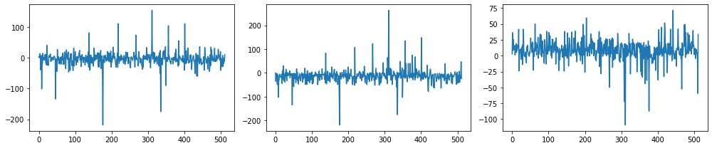


### Given an image pair, compute differentiation in different layers

We may compute differentiation in two ways:
1. What is the distance between the distributions of activations for the two images? The differences do not look significant.
2. What is the filter to filter difference in activations (how do I compute this?)? One way (looking at the results above) would be to normalize the responses (so that the dot product of response with itself for each stimulus is 1), then take the dot product, as done below.


```python
def compute_rdm(activations, norm=False, pl=False):
    if pl:
        f, axes = plt.subplots(5, 4, sharey=True, figsize=(16, 12))
        axes = axes.flatten()
    diff_mats = np.zeros((len(activations), activations[0].shape[0], activations[0].shape[0]))
    for i in range(len(activations)):
        layer_activations = activations[i]
        if len(layer_activations.shape) > 3:
            mean_activations = layer_activations.mean(axis=1).mean(axis=1)
            if norm:
                mean_activations = mean_activations/mean_activations.max()
            n_samples = mean_activations.shape[0]
    #         diff_mats[i] = np.zeros((n_samples, n_samples))
            for j in range(n_samples):
                for k in range(j+1, n_samples):
                    diff_mats[i][j][k] = np.sqrt(sum((mean_activations[j]-mean_activations[k])*(mean_activations[j]-mean_activations[k])))
                    diff_mats[i][k][j] = diff_mats[i][j][k]
            if pl:
                axes[i].plot(mean_activations.T)
                axes[i].set_title(layer_names[i])
    if pl:
        plt.tight_layout()
        plt.suptitle('Normalized activations in different layers for test stimuli', y=1.02, size=18);
    return diff_mats
```


```python
diff_mats = compute_rdm(activations, pl=True)
```


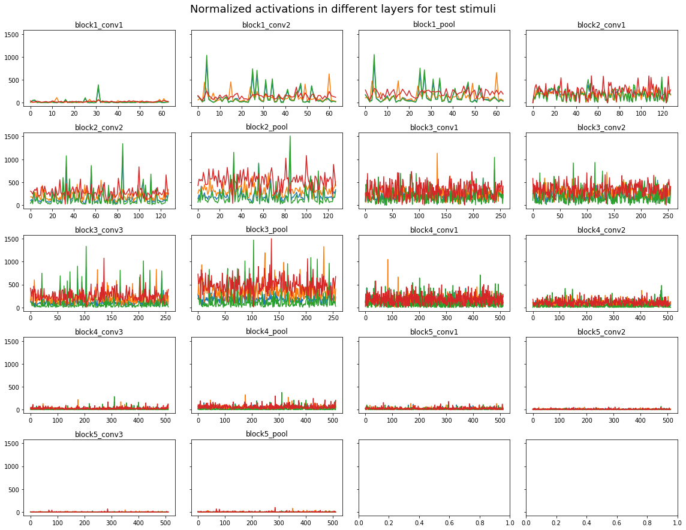


### Activity distance as a function of layer

- 0: cat
- 1: dog
- 2: oboe
- 3: tiger


```python
diff_mats = compute_rdm(activations)
plt.figure(figsize=(16, 4))
for i in range(diff_mats.shape[1]):
    for j in range(i+1, diff_mats.shape[2]):
        plt.plot(diff_mats[:, i, j], '-o', label='d(%d, %d)'%(i, j))
plt.setp(plt.gca(), xticks=range(len(layer_names)), xticklabels=layer_names)
plt.xticks(rotation=45)
plt.legend(loc=0)
plt.xlabel('Layer -> increasing depth')
plt.ylabel('Euclidean distance')
plt.title('Without normalization of activity in each filter');
```


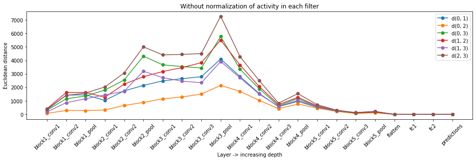


```python
diff_mats = compute_rdm(activations, norm=True)
plt.figure(figsize=(16, 4))
for i in range(diff_mats.shape[1]):
    for j in range(i+1, diff_mats.shape[2]):
        plt.plot(diff_mats[:, i, j], '-o', label='d(%d, %d)'%(i, j))
plt.setp(plt.gca(), xticks=range(len(layer_names)), xticklabels=layer_names)
plt.xticks(rotation=45)
plt.legend(loc=0)
plt.xlabel('Layer -> increasing depth')
plt.ylabel('Euclidean distance')
plt.title('With normalization of activity in each filter');
```


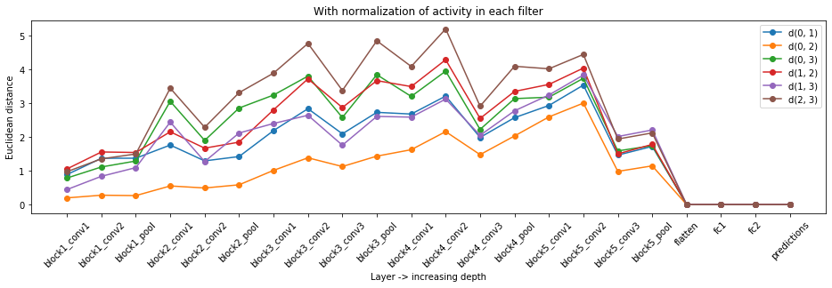

