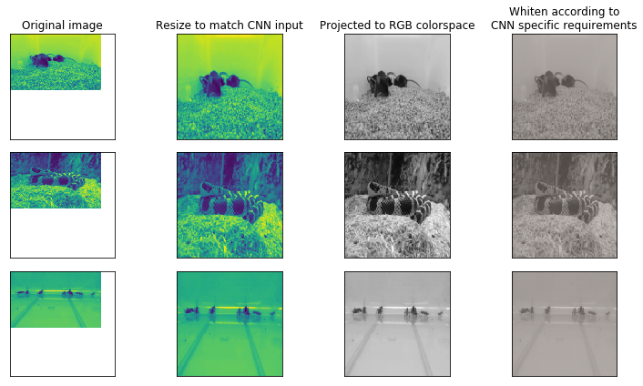
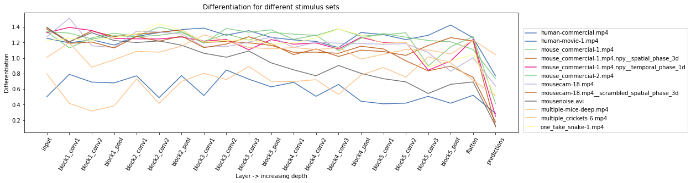
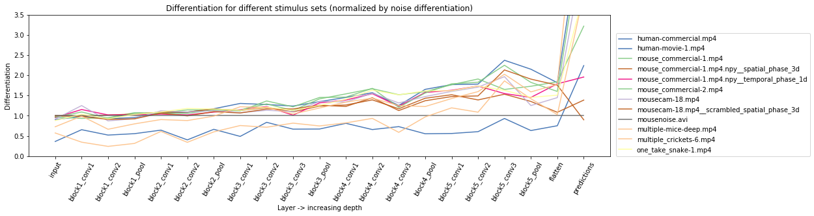
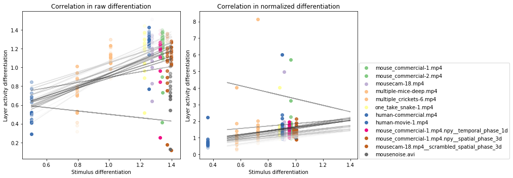
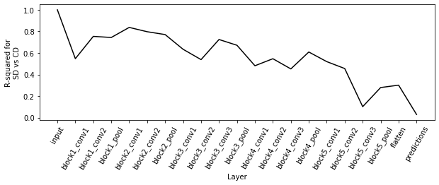
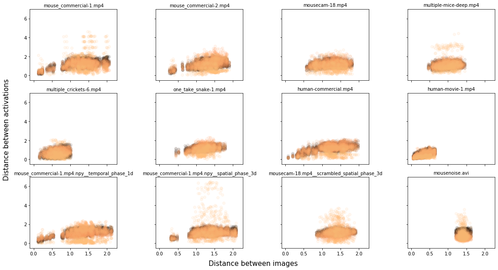
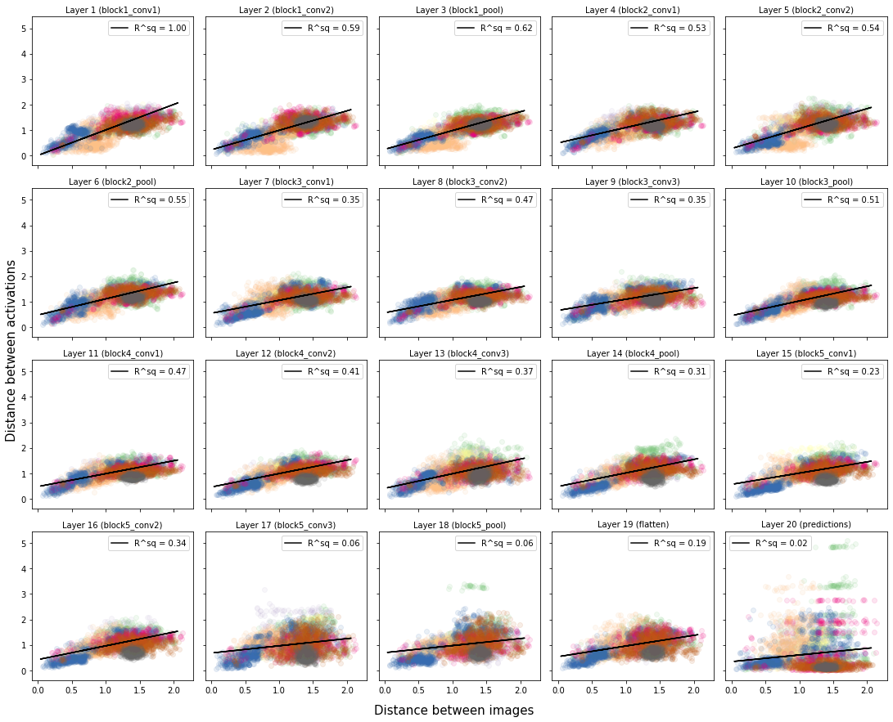
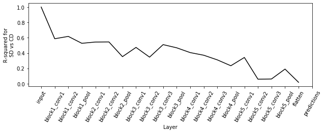

# VGG16 tries out mouse stimuli!


```python
%%capture --no-stdout
%load_ext autoreload
%autoreload 2
from scipy.stats.stats import linregress
import pickle
from tqdm import tqdm_notebook as tqdm
import PIL
from CNNDifferentiation import *
from keras.applications.vgg16 import VGG16, decode_predictions, preprocess_input

cnn = CNNAnalysis(VGG16(weights='imagenet', include_top=True),
                  decode_predictions, preprocess_input, n_units=200)
```


```python
stim_frames, stim_names = {}, []
for fn in sorted(glob('../../differentiation-analysis/stimuli/stimuli/*.npy'),
                 key=lambda x: int(x.split('/')[-1][:2])):
    stim_name = fn.split('/')[-1][3:-4]
    stim_names.append(stim_name)
    stim = np.load(fn)
    stim_frames[stim_name] = stim[::30]
```

# Example frames showing preprocessing

Note that the processing pipeline is copied over from CNNDifferentiation.py, and the actual pipeline might have changed.


```python
movie_id = 0 # choose among stim_names
frames = [1, 5, 17] # choose any 3
f, axes = plt.subplots(3, 4, sharex=True, sharey=True, figsize=(10, 6))
image_data = stim_frames[stim_names[movie_id]]
images = np.zeros((30, 224, 224, 3))
for i in frames:
    axes[frames.index(i), 0].imshow(image_data[i])
    resized_image = PIL.Image.fromarray(image_data[i]).resize((224, 224))
    axes[frames.index(i), 1].imshow(resized_image)
    images[i] = np.broadcast_to(image.img_to_array(resized_image), images[i].shape)
    axes[frames.index(i), 2].imshow(np.array(images[i], dtype=int))
    images[i] = cnn.preprocess_input(images[i])
    axes[frames.index(i), 3].imshow(np.array((images[i]+255)/2, int))
    if frames.index(i) == 0:
        axes[frames.index(i), 0].set_title('Original image')
        axes[frames.index(i), 1].set_title('Resize to match CNN input')
        axes[frames.index(i), 2].set_title('Projected to RGB colorspace')
        axes[frames.index(i), 3].set_title('Whiten according to\nCNN specific requirements')
for ax in axes.flatten():
    plt.setp(ax, xticks=[], yticks=[])
plt.tight_layout()
```





```python
cnns = {}
for stim in stim_names:
    print('Processing %s'%stim)
    cnns[stim] = CNNAnalysis(VGG16(weights='imagenet', include_top=True),
                             decode_predictions, preprocess_input, n_units=200)
    cnns[stim].load_arrays(stim_frames[stim])
    print('Computing RDM...')
    cnns[stim].compute_differentiation(discard_remaining=True)
```

```python
rdms = {}
for key in cnns.keys():
    rdms[key] = cnns[key].rdms
with open('../data/08-07-2019_vgg16_200-unit_all-stimuli.dict', 'wb') as f:
    pickle.dump(rdms, f)
```

# Differentiation for different movies (image sets)

As discussed with Anton, I am taking one frame for every second and passing it to the CNN. I then use the responses of selected units for the set of 30 input images to measure differentiation.


```python
f, ax = plt.subplots(1, 1, figsize=(16,4))
for stim in sorted(stim_names):
    cnns[stim].plot_differentiation(ax=ax, label=stim, c=cm.Accent(stim_names.index(stim)/len(stim_names), 0.9))
plt.legend(loc=(1.01, 0))
plt.title('Differentiation for different stimulus sets');
```





```python
f, ax = plt.subplots(1, 1, figsize=(16,4))
cnns['mousenoise.avi'].plot_differentiation(ax=ax, c=cm.Accent(0, 0))
for stim in sorted(stim_names):
    ax.plot(cnns[stim].differentiation/cnns['mousenoise.avi'].differentiation,
            label=stim, c=cm.Accent(stim_names.index(stim)/len(stim_names), 0.9))
plt.ylim(0, 3.5)
plt.legend(loc=(1.01, 0))
plt.title('Differentiation for different stimulus sets (normalized by noise differentiation)');
```





Some observations:
1. human-movie and multiple-crickets have very little changing during the movies, and so the input image differentiation is super low. This gets propagated through all the layers, which is unsurprising.
2. Other patterns are similar to what we saw in the validation notebook, except that the overall level of differentiation is slightly lower. The prediction layer on the other hand shows particularly high differentiation. Below, I print out the top class predictions for all imputs to see if this makes sense (it generally does).


```python
diff_by_stim = np.zeros((len(cnns.keys()), cnns[stim_names[0]].n_layers))
for stim in stim_names:
    diff_by_stim[stim_names.index(stim)] = cnns[stim].differentiation
```

## Predictions

Just to verify that there are some labels that make sense


```python
for stim in cnns.keys():
    print(stim)
    for im in range(cnns[stim].n_images):
        print(cnns[stim].image_labels[im][1], end='; ')
    print('\n')
```

    mouse_commercial-1.mp4
    tarantula; toaster; skunk; chimpanzee; tub; hay; hay; hay; hay; hay; plow; barn; park_bench; radio_telescope; worm_fence; syringe; syringe; syringe; syringe; syringe; stone_wall; coral_fungus; hen-of-the-woods; hen-of-the-woods; hen-of-the-woods; shovel; picket_fence; tiger_cat; radiator; radiator; 
    
    mouse_commercial-2.mp4
    stone_wall; picket_fence; stone_wall; stone_wall; stone_wall; forklift; barbell; bookshop; bookshop; totem_pole; binoculars; skunk; skunk; weasel; baboon; cockroach; wolf_spider; wolf_spider; cockroach; cockroach; fountain; confectionery; goblet; plastic_bag; bubble; king_snake; king_snake; king_snake; king_snake; king_snake; 
    
    mousecam-18.mp4
    birdhouse; stone_wall; stone_wall; white_stork; mountain_tent; hay; hay; barn; hay; hay; coyote; black_grouse; coyote; dogsled; worm_fence; Kerry_blue_terrier; lakeside; worm_fence; Kerry_blue_terrier; hay; hay; coyote; coyote; coral_fungus; cliff; bighorn; black_grouse; hay; coyote; hay; 
    
    multiple-mice-deep.mp4
    baboon; schipperke; shower_curtain; coffee_mug; bison; skunk; guinea_pig; chimpanzee; skunk; toaster; skunk; tarantula; koala; coffeepot; schipperke; porcupine; tarantula; airship; hamster; skunk; tarantula; skunk; Italian_greyhound; gorilla; baboon; tarantula; shower_curtain; schipperke; schipperke; Shetland_sheepdog; 
    
    multiple_crickets-6.mp4
    syringe; refrigerator; refrigerator; medicine_chest; bathtub; bathtub; bathtub; bathtub; bathtub; refrigerator; bathtub; bathtub; bathtub; bathtub; bathtub; bathtub; bathtub; medicine_chest; bathtub; bathtub; bathtub; bathtub; bathtub; bathtub; bathtub; bathtub; syringe; refrigerator; bathtub; bathtub; 
    
    one_take_snake-1.mp4
    king_snake; horned_viper; diamondback; half_track; king_snake; sidewinder; king_snake; Great_Dane; Great_Dane; hognose_snake; Great_Dane; Great_Dane; king_snake; Great_Dane; Great_Dane; Great_Dane; king_snake; king_snake; king_snake; king_snake; fountain; Great_Dane; Gila_monster; Gila_monster; fur_coat; Great_Dane; Great_Dane; king_snake; king_snake; king_snake; 
    
    human-commercial.mp4
    barbershop; barbershop; barbershop; lab_coat; barbershop; wok; wok; wok; wok; potter's_wheel; file; cab; file; refrigerator; file; fountain; swab; fountain; fountain; fountain; trailer_truck; streetcar; steam_locomotive; steam_locomotive; park_bench; mixing_bowl; mixing_bowl; mixing_bowl; mixing_bowl; mixing_bowl; 
    
    human-movie-1.mp4
    vacuum; vacuum; vacuum; vacuum; vacuum; vacuum; vacuum; vacuum; vacuum; vacuum; vacuum; vacuum; vacuum; iron; iron; iron; vacuum; vacuum; vacuum; vacuum; vacuum; vacuum; vacuum; vacuum; iron; vacuum; vacuum; iron; iron; iron; 
    
    mouse_commercial-1.mp4.npy__temporal_phase_1d
    fountain; fountain; fountain; fountain; fountain; hay; hay; hay; hay; hay; fountain; fountain; doormat; fountain; soccer_ball; syringe; syringe; syringe; syringe; refrigerator; fountain; fountain; fountain; fountain; hay; fountain; fountain; fountain; fountain; fountain; 
    
    mouse_commercial-1.mp4.npy__spatial_phase_3d
    velvet; airship; window_screen; window_screen; window_screen; window_screen; window_screen; milk_can; milk_can; milk_can; caldron; coyote; castle; barn; window_screen; window_screen; window_screen; window_screen; killer_whale; window_shade; window_screen; window_screen; nail; window_screen; window_screen; window_screen; nail; window_screen; window_screen; window_screen; 
    
    mousecam-18.mp4__scrambled_spatial_phase_3d
    nail; hatchet; nail; window_screen; window_screen; window_screen; window_screen; window_screen; window_screen; window_screen; window_screen; window_screen; window_screen; window_screen; window_screen; window_screen; window_screen; window_screen; window_screen; window_screen; airship; window_screen; window_screen; window_screen; nail; window_screen; window_screen; window_screen; window_screen; milk_can; 
    
    mousenoise.avi
    doormat; chain_mail; doormat; doormat; chain_mail; chain_mail; chain_mail; chain_mail; chain_mail; chain_mail; doormat; chain_mail; doormat; chain_mail; doormat; chain_mail; chain_mail; chain_mail; chain_mail; doormat; chain_mail; velvet; doormat; chain_mail; chain_mail; wool; chain_mail; dishrag; chain_mail; chain_mail; 
    


# Correlations between SD and CD

CD is shorthand for CNN-Differentiation
<a id='color_ref'></a>


```python
rs, nrs = [], []
plt.figure(figsize=(10, 5))
plt.subplot(1, 2, 1)
for stim in stim_names:
    for i in range(cnns[stim].n_layers):
        plt.scatter(cnns[stim].differentiation[0], cnns[stim].differentiation[i],
                    color=cm.Accent(stim_names.index(stim)/len(stim_names), i/cnns[stim].n_layers))
for l in range(cnns[stim_names[0]].n_layers):
    m, c, r, p, s = linregress(diff_by_stim[:, 0], diff_by_stim[:, l])
    plt.plot(diff_by_stim[:, 0], diff_by_stim[:, 0]*m+c,
             color=cm.Greys(l/cnns[stim_names[0]].n_layers, 0.4))
    rs.append(r)
plt.xlabel('Stimulus differentiation')
plt.ylabel('Layer activity differentiation')
plt.title('Correlation in raw differentiation')
plt.subplot(1, 2, 2)
for stim in stim_names:
    label = None
    for i in range(cnns[stim].n_layers):
        if i == 20:
            label = stim
        plt.scatter(cnns[stim].differentiation[0]/cnns['mousenoise.avi'].differentiation[0],
                    cnns[stim].differentiation[i]/cnns['mousenoise.avi'].differentiation[i],
                    color=cm.Accent(stim_names.index(stim)/len(stim_names), i/cnns[stim].n_layers), label=label)
for l in range(cnns[stim_names[0]].n_layers):
    m, c, r, p, s = linregress(diff_by_stim[:, 0]/diff_by_stim[11, 0], diff_by_stim[:, l]/diff_by_stim[11, l])
    plt.plot(diff_by_stim[:, 0], diff_by_stim[:, 0]*m+c,
             color=cm.Greys(l/cnns[stim_names[0]].n_layers, 0.4))
    nrs.append(r)
plt.xlabel('Stimulus differentiation')
plt.ylabel('Layer activity differentiation')
plt.title('Correlation in normalized differentiation')
plt.tight_layout()
plt.legend(loc=(1.01, 0));
```





We see that there is _some_ correlation between input differentiation and activity differentiation. The above figure is for all layers and stimuli put together.

The color lightness corresponds to layer, so that darker colors are higher layers. The figure below shows how correlation depends on layer depth.

## Correlation in differentiation decreases with depth


```python
plt.figure(figsize=(10, 3))
plt.plot(range(len(rs)), np.array(rs)**2, c='k')
plt.xlabel('Layer')
plt.ylabel('R-squared for\nSD vs CD')
plt.xticks(ticks=range(len(cnns[stim_names[0]].layer_names)), labels=cnns[stim_names[0]].layer_names, rotation=60);
```





## Correlations by stimulus set
The figure below shows the image and activation distance for every pair of input images in the different stimulus sets. Darker colors correspond to earlier layers (so black is the first layer). Again we see that there might be a tiny bit of correlation between images and activity. The correlations are likely obscured by the prediction layer which is at the top. Generally stimulus set does not seem to modulate overall correlation.


```python
uti = np.triu_indices(30, k=1)
f, axes = plt.subplots(3, 4, sharex=True, sharey=True, figsize=(15, 8))
for stim in cnns.keys():
    for i in range(1, cnns[stim].n_layers):
        axes.flatten()[stim_names.index(stim)].scatter(cnns[stim].rdms[0][uti], cnns[stim].rdms[i][uti],
                                                       color=cm.copper(i/cnns[stim].n_layers, 0.1))
    axes.flatten()[stim_names.index(stim)].set_title(stim, size=10)
f.tight_layout()
f.text(0.5, -0.01, 'Distance between images', ha='center', va='center', size=15)
f.text(0.0, 0.5, 'Distance between activations', ha='center', va='center', rotation=90, size=15);
```





## Correlations by layer
Here, instead of separating out by stimulus set, I have separated out the data by layer. The colors indicate stimulus set (same colors from [above](#color_ref)). Here we see fairly strong correlations between distance in stimulus pair and layer activity. The correlation decreases monotonically with layer depth (see next figure).


```python
dist_by_layer = np.zeros((uti[0].shape[0]*len(stim_names), cnns[stim_names[0]].n_layers-1))
drs = []
uti = np.triu_indices(30, k=1)
f, axes = plt.subplots(4, 5, sharex=True, sharey=True, figsize=(15, 12))
for stim in cnns.keys():
    for i in range(1, cnns[stim].n_layers):
        axes.flatten()[i-1].scatter(cnns[stim].rdms[0][uti], cnns[stim].rdms[i][uti],
                                  color=cm.Accent(stim_names.index(stim)/len(stim_names), 0.1))
        axes.flatten()[i-1].set_title('Layer %d (%s)'%(i, cnns[stim].layer_names[i]), size=10)
        dist_by_layer[stim_names.index(stim)*uti[0].shape[0]:(stim_names.index(stim)+1)*uti[0].shape[0], i-1] = cnns[stim].rdms[i][uti]
for i in range(1, cnns[stim_names[0]].n_layers):
    m, c, r, p, s = linregress(dist_by_layer[:, 0], dist_by_layer[:, i-1])
    axes.flatten()[i-1].plot(dist_by_layer[:, 0], dist_by_layer[:, 0]*m+c,
                             label='R^sq = %.2f'%r**2, c='k')
    axes.flatten()[i-1].legend()
    drs.append(r)
f.tight_layout()
f.text(0.5, -0.01, 'Distance between images', ha='center', va='center', size=15)
f.text(0.0, 0.5, 'Distance between activations', ha='center', va='center', rotation=90, size=15);
```





### Correlation in distance decreases with depth


```python
plt.figure(figsize=(10, 3))
plt.plot(range(len(drs)), np.array(drs)**2, c='k')
plt.xlabel('Layer')
plt.ylabel('R-squared for\nSD vs CD')
plt.xticks(ticks=range(len(cnns[stim_names[0]].layer_names)), labels=cnns[stim_names[0]].layer_names, rotation=60);
```





```python

```
