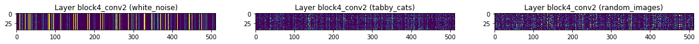

# Measuring differentiation in CNN layers
This notebook acts as a validation test for the code to analyze differentiation in the different layers of a image recognition CNN. We use the **VGG16** network, pretrained on the imagenet dataset, as provided by the keras python package.

The differentiation analysis is applied to three different sets of images with 43 images in each set:
- _Noise_ : white RGB noise
- _Cats_  : Images of cats (that the network classifies as 'tabby_cats' with probability > 0.5)
- _Random_: Images of random objects

For each of the three categories, we measure the differentiation in the activities in network layers as the median distance in activation space between responses to image pairs from the category.

### Our intuition is as follows

Early layers of the network respond strongly to local features such as edges, patterns etc. Later layers respond to the semantic content of the image (as recognized by the network). Local properties of images are the most distinct for _noise_ images which have no structure at all, and so differentiaition should be highest for _noise_, and _cats_ and _random_ should have a lower differentiation in early layers.

In intermediate layers, differentiation should go down for _noise_, and up for _cats_ and _random_ as the higher order patterns become increasingly distinct for real images, and uniform for white noise images.

Finally, in the final few layers, differentiation for _cats_ should go down again, given that the network recognizes all images as the same category. On the other hand, differentiation for _random_ should continue to go up as the semantic content of the images is also divergent.

Below, I document the details of the choices made in the analysis for future reference.


```python
%%capture --no-stdout
%load_ext autoreload
%autoreload 2
import pickle
from tqdm import tqdm_notebook as tqdm
import PIL
from CNNDifferentiation import *
from keras.applications.vgg16 import VGG16, decode_predictions, preprocess_input

cnn = CNNAnalysis(VGG16(weights='imagenet', include_top=True),
                  decode_predictions, preprocess_input, n_units=200)
```


```python
unit_type = 'random'
diffs = {'random_200' : {}, 'random_10000' : {}, 'random_100000' : {},
         'top_200' : {}, 'top_1000' : {}, 'top_10000' : {}}
# with open('../data/08-12-2019-3_way_differentiation-200_10000_100000.pkl', 'rb') as f:
#     diffs = pickle.load(f)
activations = {}
for p in ['../data/random_images/*.jpg',
          '../data/white_noise/*.jpg',
          '../data/tabby_cats/*.jpg']:
    cnn.load_images(p)
    for n_units in [200, 10000, 100000]:
        cnn.n_units = n_units
        cnn.compute_differentiation(unit_type=unit_type, resample=True)
        diffs['%s_%d'%(unit_type, n_units)][p.split('/')[-2]] = cnn.differentiation
    activations[p.split('/')[-2]] = cnn.activations
```

## Prediction layer activations for different image sets
As a sanity check, the activations in the final prediction layer of the network are plotted for all input images below as a heatmap. The final layer ahs 1000 units, each corresponding to one of the 1000 classes that the network was trained to distinguish.

As can be seen, _random_ images lead to peak activations in very different units. _Cat_ images strongly activate the same unit (and a couple of neighbors, and more weakly, a few other scattered units) in the prediction layer. _White noise_ images tend to systematically activate one of a few different units in prediction layer, so that there are a few units that are consistently activated across images.


```python
for p in ['../data/random_images/*.jpg',
          '../data/tabby_cats/*.jpg',
          '../data/white_noise/*.jpg',]:
    plt.figure(figsize=(20, 4))
    pred_acts = activations[p.split('/')[-2]][-1] / activations[p.split('/')[-2]][-1].mean()
    pred_acts = pred_acts / pred_acts.std()
    plt.imshow(pred_acts, vmin=0, vmax=1)
    plt.title('Activations in prediction layer for %s'%(p.split('/')[-2]))
```


## Correctly normalizing activity
In the previous analysis, my normalization was not appropriate (I was normalizing activity so that the mean activity in each layer is 1). A better way to normalize is to set the mean activity to 0 and SD of activity to 1. With this normalization, the Euclidean distance metric becomes equivalent to correlation distance, which is more commonly used in ANN analyses. Moreover, this normalization can also be applied to the input images, and so, differentiation can be directly compared across layers and with the input image.

We previously saw that differentiation behaved in the same way for noise, cats and random images. This was a little puzzling, but then I realized that it might be an artefact of sampling only 200 units. Activations in CNNs are sparse, and by sampling a very small fraction of units, I was probably seeing only the inactive units that do not matter anyway. That would explain the lack of difference in noise vs cats vs random image sets.

To see if this reasoning is indeed true, I repeated the analysis, but now, sampled 10,000 and 100,000 units from each layer. Moreover, in order to compare the distance metric with the 200 unit case, I normalized the distance by the number of dimensions, so that the value plotted is actually the mean distance per dimension. With this normalization, the Euclidean distance metric is now completely identical to the correlation distance metric.


```python
colors = {'white_noise' : cm.Greys(0.6, 0.8), 'tabby_cats' : cm.Reds(0.8, 0.8), 'random_images' : cm.Blues(0.8, 0.8)}
linestyles = {'200' : '--', '10000' : '-.', '100000' : '-'}
plt.figure(figsize=(16, 4))
for key in ['random_200', 'random_10000', 'random_100000']:
    ls = linestyles[key.split('_')[1]]
    for category in diffs[key].keys():
        c = colors[category]
        plt.plot(range(cnn.n_layers), diffs[key][category],
                 ls=ls, c=c, label='%s %s'%(key.split('_')[1], category))
plt.xlabel('Layer')
plt.ylabel('Differentiation')
plt.setp(plt.gca(), xticks=range(cnn.n_layers), xticklabels=cnn.layer_names)
plt.xticks(rotation=60)
plt.legend();
#plt.grid()
```


## 200 units are enough to get interesting differentiation signals
1. As we expect intuitively in the case of _noise_ images, differentiation is highest in the lowest layers, and decreases monotonically with depth.
2. In general, 10,000 and 100,000 units have a nearly identical signal. The signal for 200 units closely follows the other two, but is noisier, which is not surprising.
  
   This is contrary to previous analysis with 200 units, where noise and image signals were identical. It turned out I had a bug in the code, and previously was not looking at the same set of units across images. That has been fixed now, and even with 200 units we see sensible results.
3. Note that the differentiation does not really increase with depth for meaningful images, but rather remains constant (and in the very final layers, decreases for the same-category set of _cats_).

## Normalizing differentiation with _noise_
In the actual experiments, it was useful to normalize differentiation by the observed differentiation for spontaneous activity. This allowed comparing across neuron-types and animals. We can follow the same process with CNNs by normalizing differentiation with _white noise_ differentiation. Here I have normalized by the _white noise_ differentiation for 100,000 units since it is less noisy and probably the same as the mean 200 unit differentiation over multiple trials.

The interesting point here is that with only 200 units, differentiation in the prediction layer decreases for both _cats_ and _random_ - here, finally, the small sample size really makes a difference. With just 200 units, we are likely to miss the _tabby cats_ class entirely, and also have a low probablity of hitting the right classes in _random_. Thus, differentiation is driven by the very low activations in the rest of the classes with minute probabilities.

With 10,000 or 100,000 units, we are including activity of all units from the prediction layer, and thus, certainly including the distinctive classes that have high activation. Consequently we see very different patterns for _cats_ and _random_: _cats_ now have a very low differentiation, while _random_ has particularly high differentiation.


```python
plt.figure(figsize=(16, 4))
for key in ['random_200', 'random_10000', 'random_100000']:
    ls = linestyles[key.split('_')[1]]
    for category in diffs[key].keys():
        c = colors[category]
        plt.plot(range(cnn.n_layers), diffs[key][category]/diffs['random_100000']['white_noise'],
                 ls=ls, c=c, label='%s %s'%(key.split('_')[1], category))
plt.xlabel('Layer')
plt.ylabel('Normalized differentiation')
plt.setp(plt.gca(), xticks=range(cnn.n_layers), xticklabels=cnn.layer_names)
plt.xticks(rotation=60)
plt.legend();
#plt.grid()
```


# A look at actual activations
**This section was important for debugging the code when differentiation was showing the same signal for _noise_, _cats_ and _random_. It is not particularly informative now, but might still be interesting to look at.**

CNNs apply a set of maps to go from a small receptive field within the input to a corresponding set of units in the output. Each of these maps acts as a _filter_. In the initial layers, these filters have been observed to act like the gabor filters for edge and orientation detection etc. It is interesting to see how the mean activity of filters changes with depth for the three sets.

## Mean filter activations


```python
index = {'white_noise' : 0, 'tabby_cats' : 1, 'random_images' : 2}
```


```python
for layer in range(cnn.n_layers):
    f, axes = plt.subplots(1, 3, figsize=(20, 3))
    for key in activations.keys():
        norm_acts = activations[key][layer] - activations[key][layer].mean()
        norm_acts = norm_acts / norm_acts.std()
        try:
            axes[index[key]].imshow(norm_acts.mean(axis=(1, 2)), vmin=0, vmax=1)
        except:
            axes[index[key]].imshow(norm_acts, vmin=-1, vmax=1)
        axes[index[key]].set_title('Layer %s (%s)'%(cnn.layer_names[layer], key))
```

    /home/saurabh.gandhi/Projects/.env_ann/lib/python3.6/site-packages/ipykernel_launcher.py:2: RuntimeWarning: More than 20 figures have been opened. Figures created through the pyplot interface (`matplotlib.pyplot.figure`) are retained until explicitly closed and may consume too much memory. (To control this warning, see the rcParam `figure.max_open_warning`).
      





There are many observations to be made here, starting with the top panels and working downward:
1. In the images themselves (input layer) we do not see any vertical patterns (mean structure in R, G and B channels). This is a good sanity check, because our input images do not have a particularly large component of R or G or B. Interestingly, there is vertical structure in the noise images, which is unexpected and difficult to explain).
2. In the block1_conv* layers, we see that there are a few filters that show higher average activity than the rest, consistently for cats and random image sets. For instance, filters 31, 39 and 61 in block1_conv1. There are more such filters in conv2 and conv3 layers in block1.
3. For the same block1 layers, filters with high average activation for cats and random images are not necessarily active for noise. This is interesting, but perhaps makes sense because they are picking up low level structure and patterns such as edges, which are absent in the noise input.
4. **Given that for real images, some filters are more active than others, we might get a stronger differentiation signal by sampling units from these filters since they actually contian information (in contrast to the large set of inactive filters that are presumably not carrying as much information).**
5. We continue to see such vertical structure in the intermediate layers, with similar trends as discussed above for block1. However, to some extent in block 4, and more so in block 5, the vertical structure is arguably stronger for cats than random images. This might be the beginning of 'cat sensitive filters', which light up for cats, giving the vertical structure (ie high activation across all input images). In that sense, differentiation is now decreasing for cats, but is remaining high-ish for random images.
6. The strong vertical structure in white noise would imply that differentiation is very low for noise.

## Look at specific filters


```python
filters = {0: [0], 1 : [31], 2 : [51], 3 : [51], 4 : [125], 5 : [125], 6 : [125], 7 : [32], 8 : [37], 17 : [397, 427]}
layer = 17
filtr = 397
images = [0, 10, 21]
for layer in filters.keys():
    norm_acts = {}
    for key in activations.keys():
        norm_acts[key] = activations[key][layer] - activations[key][layer].mean()
        norm_acts[key] = norm_acts[key] / norm_acts[key].std()
    for filtr in filters[layer]:
        f, axes = plt.subplots(3, 3, sharex=True, sharey=True, figsize=(5, 5))
        for i in range(len(images)):
            axes[i][0].imshow(norm_acts['white_noise'][:, :, :, filtr][images[i]])
            axes[i][1].imshow(norm_acts['tabby_cats'][:, :, :, filtr][images[i]])
            axes[i][2].imshow(norm_acts['random_images'][:, :, :, filtr][images[i]])
            axes[i][0].set_ylabel('Image %d'%images[i])
        axes[0][0].set_title('white_noise')
        axes[0][1].set_title('tabby_cats')
        axes[0][2].set_title('random_images')
        f.suptitle('Layer %s, filter %d'%(cnn.layer_names[layer], filtr), y=0.07)
```


