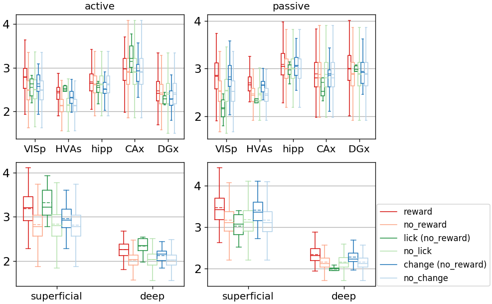
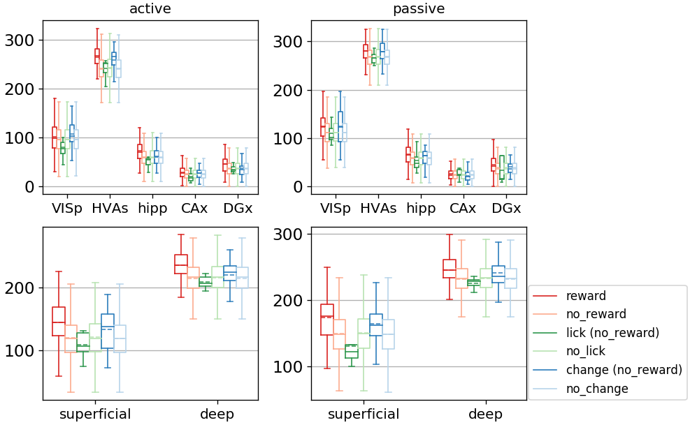
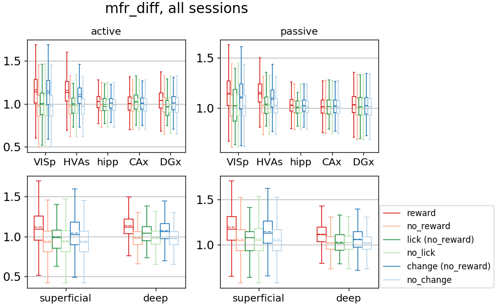
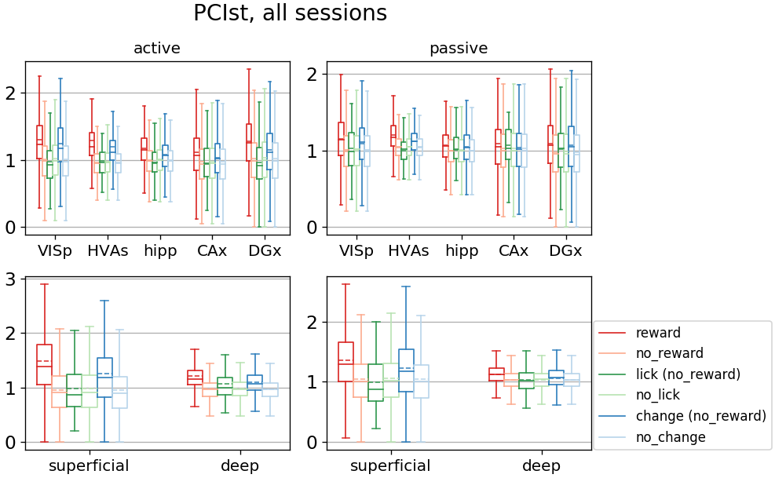
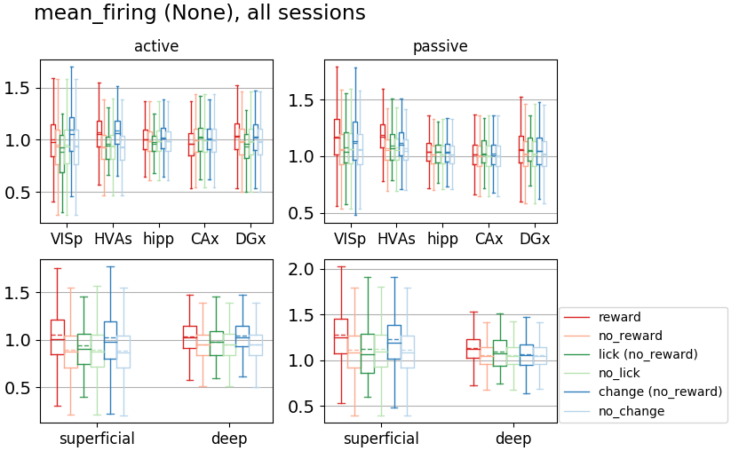

# MFR differentiation, PCIst and mean firing rate during task performance
---

## Example sessions form single mouse

### mfr differentiation

### PCIst

### mean firing rate

## Aggregate across all sessions
This is not straightforward because the overall patterns of differentiation in different areas is not conserved across sessions. Thus, we might be interested in these overall patterns, or we might be more interested in the modulation wrt different responses that is on top of this overall pattern.

Here, I choose to eliminate the overall pattern and focus on the modulation caused by different kinds of responses. To do this, differentiation values in each area are normalized by the mean differentiation value for no_change condition in that area.

### mfr differentiation

### PCIst

### mean firing rate

## More figures

### variation of differentiation across images
Overall, differentiation (or PCIst) does not depend strongly on the image itself. Below, the differentiation is plotted for 'no_change' conditions for different images, to visualize the variation across images.

