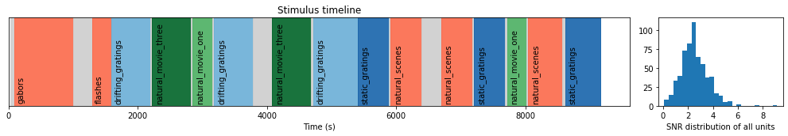
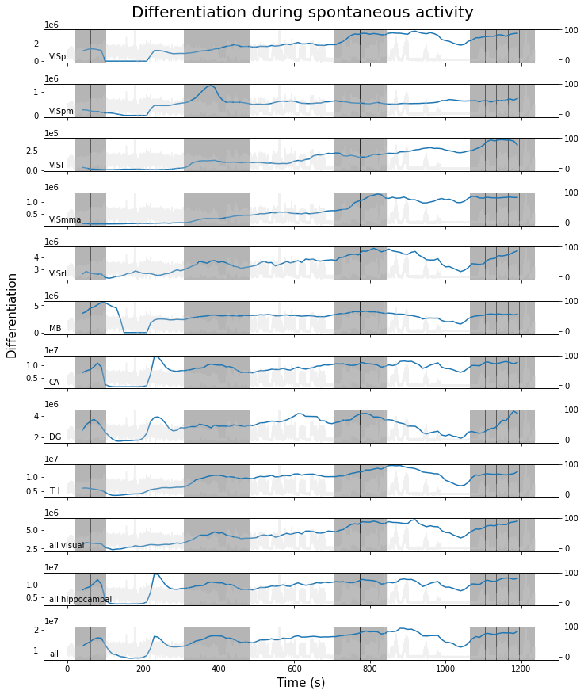
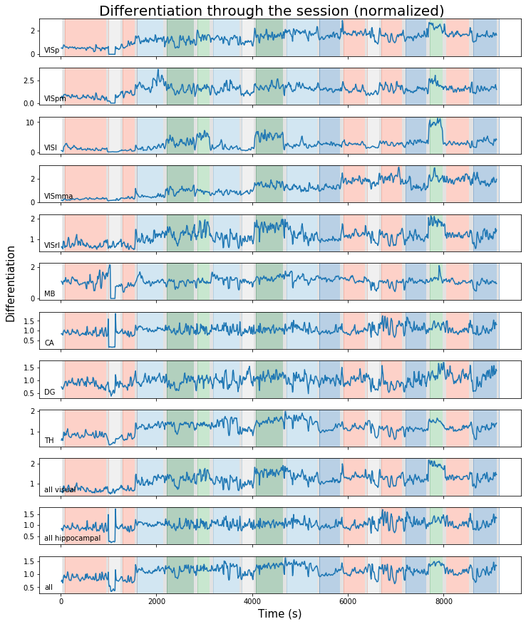
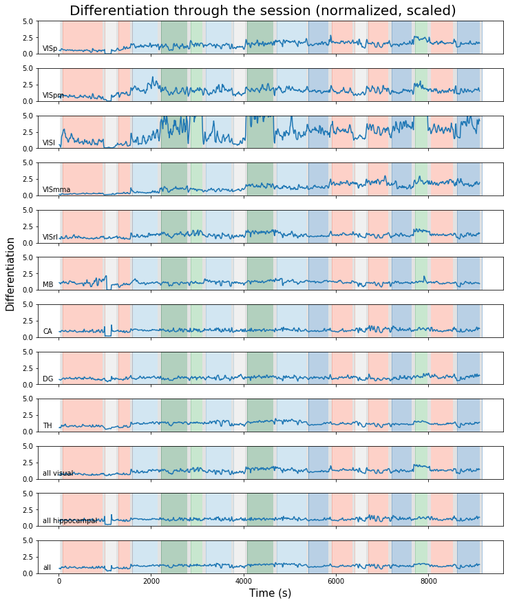
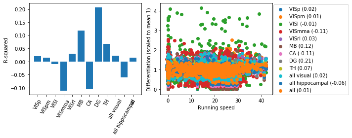

```python
%load_ext autoreload
%autoreload 2
from ephys_utilities import *
from scipy.stats.stats import linregress
```


```python
cache.get_sessions().head(n=2)
```


<div>
<style scoped>
    .dataframe tbody tr th:only-of-type {
        vertical-align: middle;
    }

    .dataframe tbody tr th {
        vertical-align: top;
    }

    .dataframe thead th {
        text-align: right;
    }
</style>
<table border="1" class="dataframe">
  <thead>
    <tr style="text-align: right;">
      <th></th>
      <th>session_type</th>
      <th>specimen_id</th>
      <th>genotype</th>
      <th>gender</th>
      <th>age_in_days</th>
      <th>project_code</th>
      <th>probe_count</th>
      <th>channel_count</th>
      <th>unit_count</th>
      <th>has_nwb</th>
      <th>structure_acronyms</th>
    </tr>
    <tr>
      <th>id</th>
      <th></th>
      <th></th>
      <th></th>
      <th></th>
      <th></th>
      <th></th>
      <th></th>
      <th></th>
      <th></th>
      <th></th>
      <th></th>
    </tr>
  </thead>
  <tbody>
    <tr>
      <th>737581020</th>
      <td>brain_observatory_1.1</td>
      <td>718643567</td>
      <td>wt</td>
      <td>M</td>
      <td>108.0</td>
      <td>NeuropixelVisualCoding</td>
      <td>6</td>
      <td>396</td>
      <td>601</td>
      <td>True</td>
      <td>[CA, DG, MB, TH, VISl, VISmma, VISp, VISpm, VI...</td>
    </tr>
    <tr>
      <th>739448407</th>
      <td>brain_observatory_1.1</td>
      <td>716813543</td>
      <td>wt</td>
      <td>M</td>
      <td>112.0</td>
      <td>NeuropixelVisualCoding</td>
      <td>6</td>
      <td>422</td>
      <td>654</td>
      <td>True</td>
      <td>[CA, DG, MB, TH, VIS, VISam, VISl, VISp, VISrl...</td>
    </tr>
  </tbody>
</table>
</div>


```python
SESSION = 737581020
session = cache.get_session_data(SESSION)
stimuli = session.stimulus_presentations
MAXTIMEMS = int(stimuli['stop_time'].values[-1])*1000
with suppress_stdout():
    stimulus_blocks = session.get_stimulus_epochs()
session.running_speed.index = (
    session.running_speed['start_time']+\
    session.running_speed['end_time']
)/2
```

    /home/saurabh.gandhi/Projects/.env_ephys/lib/python3.6/site-packages/pandas/core/ops/__init__.py:1115: FutureWarning: elementwise comparison failed; returning scalar instead, but in the future will perform elementwise comparison
      result = method(y)


```python
session.summarize()
```

    session 737581020 acquired on 2018-09-25 14:03:59-07:00
    # channels : 2218
    # probes   : 6
    # units    : 601
    # stimuli  : 70390
    Structures :  ['CA (115)', 'MB (45)', 'VISpm (13)', 'VISmma (17)', 'DG (41)', 'VISp (40)', 'TH (236)', 'VISrl (69)', 'VISl (25)']
    Stim names : ['spontaneous', 'gabors', 'flashes', 'drifting_gratings', 'natural_movie_three', 'natural_movie_one', 'static_gratings', 'natural_scenes']
    
    





```python
SAMPLING = 20 # corresponds to 1000/20 = 50 Hz
WINDOW = 50 # 50 ms bins
firing_rates = session.get_firing_rate(sampling=SAMPLING,
                                       window=WINDOW, snr=2)
unit_ids = firing_rates.columns.values
block_times = session.get_stimulus_block_times()
```

    100%|██████████| 414/414 [01:19<00:00,  5.39it/s]


---


```python
T = 80 # window time in s
res = 10
t_spontaneous = block_times['spontaneous'].shape[0]*session.sampling/1000
start_times = np.arange(0, t_spontaneous-T, res)
stims = ['spontaneous' for i in range(len(start_times))]
```


```python
print('Spontaneous activity recorded for a total of %.2f s'%t_spontaneous)
```

    Spontaneous activity recorded for a total of 1237.24 s


```python
df_spon = {}
for a in areas.keys():
    try:
        df_spon[a] = session.get_differentiation(
            stim=stims, t0=start_times, T=T, areas=areas[a]
        )
    except:
        pass
```


```python
durations = stimulus_blocks[
    stimulus_blocks['stimulus_name']=='spontaneous'
]['duration'].values.cumsum()
rs = session.running_speed.reindex(
    block_times['spontaneous'], method='nearest'
)
def plot_df(a, ax):
    for d in durations[:-1]:
        ax.axvspan(d-T/2, d+T/2, color=cm.Greys(0.4, 1))
        ax.axvline(d, color='k', lw=0.5)
    ax.plot(
        np.arange(df_spon[a].shape[0])*res+T/2,
        np.median(df_spon[a], axis=1),
    )
    ax.ticklabel_format(axis='y', style='sci', scilimits=(0, 0))
    ax = ax.twinx()
    ax.plot(np.arange(len(rs.index))*session.sampling/1000,
            rs['velocity'], c=cm.Greys(0.3, 0.3))
    ax.set_ylim(-10, 100)
    ax.annotate(a, (0.01, 0.1), xycoords='axes fraction')
```

# Df for spontaneous activity

Spike times are binned into 50 ms bins.

Differentiation is calculated in a moving frame of 80s. Each frame is divided into states spanning 1 s each (with a sampling rate of 50 Hz), and differentiation is calculated using these states.

Only units with SNR >= 3 are used.

Background (right axis) is the running speed. I wondered if differentiation is correlated with running speed in some of the areas...

Vertical lines are the different spontaneous activity blocks. Funny things can happen at the edge of the blocks, and it wouldn't be surprising if differentiation shoots up then (in the grey region), but it should go down again in the middle of the blocks (unshaded regions).

1. Differentiation varies quite a lot within spontaneous activity
2. 


```python
f, axes = plt.subplots(len(df_spon.keys()), 1, sharex=True,
                      figsize=(10, len(df_spon.keys())))
j = 0
for a in sorted(df_spon.keys(), key=lambda x: hierarchy[x]):
    plot_df(a, axes[j])
    j += 1
axes[-1].set_xlabel('Time (s)', size=15)
f.text(-0.02, 0.5, 'Differentiation', rotation=90, size=15)
f.suptitle('Differentiation during spontaneous activity',
           y=1.01, size=20)
f.tight_layout()
```





```python
T = 30 # window time in s
res = 10
t_all = block_times['all'].shape[0]*session.sampling/1000
start_times = np.arange(0, t_all-T, res)
stims = ['all' for i in range(len(start_times))]
df_all = {}
for a in areas.keys():
    try:
        df_all[a] = session.get_differentiation(
            stim=stims, t0=start_times, T=T, areas=areas[a]
        )
    except:
        pass
```


```python
durations = stimulus_blocks['duration'].values.cumsum()
rs = session.running_speed.reindex(
    block_times['all'], method='nearest'
)
def plot_df(a, ax, norm=True, scaled=True):
    factor = 1
    if norm:
        factor = np.median(df_spon[a], axis=1).mean()
    for i in stimulus_blocks.index:
        ax.axvspan(stimulus_blocks['start_time'][i],
           stimulus_blocks['stop_time'][i],
           color=stim_colors_bg.get(stimulus_blocks['stimulus_name'][i],
                                 cm.Reds(0.5, 0.3)))
    for d in durations:
        ax.axvspan(d-T/2, d+T/2, color=cm.Greys(0.2, 1))
#         ax.axvline(d, color='k', lw=0.5)
    ax.plot(
        np.arange(df_all[a].shape[0])*res+T/2,
        np.median(df_all[a], axis=1)/factor,
    )
#     ax.ticklabel_format(axis='y', style='sci', scilimits=(0, 0))
    if scaled:
        ax.set_ylim(0, 5)
#     ax = ax.twinx()
#     ax.plot(np.arange(len(rs.index))*session.sampling/1000,
#             rs['velocity'], c=cm.Greys(0.3, 0.3))
#     ax.set_ylim(-10, 100)
    ax.annotate(a, (0.01, 0.1), xycoords='axes fraction')
```

# Df for entire session
Each point along the trace shows differentiation over a 30s block (15s on either side of the point).


```python
f, axes = plt.subplots(len(df_all.keys()), 1, sharex=True,
                      figsize=(10, len(df_all.keys())))
j = 0
for a in sorted(df_all.keys(), key=lambda x: hierarchy[x]):
    plot_df(a, axes[j], norm=True, scaled=False)
    j += 1
axes[-1].set_xlabel('Time (s)', size=15)
f.text(-0.02, 0.5, 'Differentiation', rotation=90, size=15)
f.suptitle('Differentiation through the session (normalized)',
           y=1.01, size=20)
f.tight_layout()
```





```python
f, axes = plt.subplots(len(df_all.keys()), 1, sharex=True,
                      figsize=(10, len(df_all.keys())))
j = 0
for a in sorted(df_all.keys(), key=lambda x: hierarchy[x]):
    plot_df(a, axes[j], norm=True)
    j += 1
axes[-1].set_xlabel('Time (s)', size=15)
f.text(-0.02, 0.5, 'Differentiation', rotation=90, size=15)
f.suptitle('Differentiation through the session (normalized, scaled)',
           y=1.01, size=20)
f.tight_layout()
```





# Correlation between running speed and differentiation


```python
rs = session.running_speed.rolling(
    60, center=True
).mean().reindex(
    start_times+T/2, method='nearest'
)['velocity'].values
idx = np.where(~np.isnan(rs))[0]
```


```python
r2 = []
f, (ax1, ax2) = plt.subplots(1, 2, figsize=(10, 4))
for a in sorted(df_all.keys(), key=lambda x: hierarchy[x]):
    df = np.median(df_all[a], axis=1)
    m, c, r, p, s = linregress(rs[idx], df[idx]/np.nanmean(df))
    ax2.scatter(rs, df/df.mean(), label='%s (%.2f)'%(a, r))
    r2.append(r)
ax2.legend(loc=(1.01, 0))
ax2.set_xlabel('Running speed')
ax2.set_ylabel('Differentiation (scaled to mean 1)')
ax1.bar(sorted(df_all.keys(), key=lambda x: hierarchy[x]), r2)
ax1.tick_params(axis='x', rotation=60)
ax1.set_ylabel('R-squared')
f.tight_layout()
```





# Correlation between SD and ED


```python
stimulus_frames = {}
for movie in glob(os.path.join(STIMDIR, '*.h5')):
    stimulus_frames[movie.split('/')[-1][:-3]] = np.load(movie)
```


```python
df_stim = {}
for stim in stimulus_frames.keys():
    nm = stimulus_frames[stim]
    nm = nm.reshape(nm.shape[0], nm.shape[1]*nm.shape[2]).T
    df_stim[stim] = spectral_differentiation(nm, sample_rate=30)
```


```python
df_stim['natural_movie_1'].shape
```


    (435,)


```python
df_movies = {}
for stim in ['natural_movie_one-0', 'natural_movie_three-0']:
    df_movies[stim] = session.get_differentiation([stim], T=30)
```


```python
df_movies['natural_movie_one-0'].shape
```


    (1, 435)


```python

```
