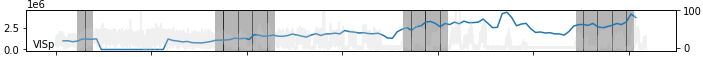
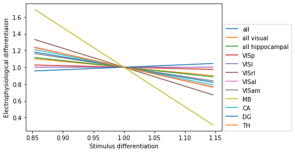

# Df of spontaneous activity varies a lot
Spike times are binned into 50 ms bins.

Differentiation is calculated in a moving frame of 30s. Each frame is divided into states spanning 1 s each (with a sampling rate of 50 Hz), and differentiation is calculated using these states.

Only units with SNR >= 2 are used (but results look the same for snr > 3, snr > 3.5).

Background (right axis) is the running speed. I wondered if differentiation is correlated with running speed in some of the areas...

Vertical lines are the different spontaneous activity blocks. Funny things can happen at the edge of the blocks, and it wouldn't be surprising if differentiation shoots up then (in the dark grey region), but it should go down again in the middle of the blocks (unshaded regions).

The figure shows differentiation for spontaneous activity for two sample regions, VISp and MB. The same for all regions can be found at the bottom of the page.

# Df for stimuli is not consistant

Also note that in the thalamus, differentiation during stimuli is very low, nearly the same as for spontaneous activity, with very small modulations.

# Df as a function of 'layer'

The figure below shows the differentiation for different stimuli as a function of 'layer' within the visual hierarchy. The layers are ordered according to [this study](https://www.biorxiv.org/content/10.1101/292961v1.full).

We see that Df increases through TH up to early visual areas and then drops down again. The mean Df across sessions and repeats of stimulus are shown.

# Df is related, but weakly, to running speed
Example data for two different sessions

# COrrelation between SD and ND
For the same two sessions as above

# Data for all areas

## Df for spontaneous activity

## Df for stimuli

## Df for all stimuli (axes scaled)

