# Differentiation and mean firing rates
All data in this section is for differentiation calculated with a 1s state, over 30s windows

## Differentiation and mean firing rate are strongly correlated
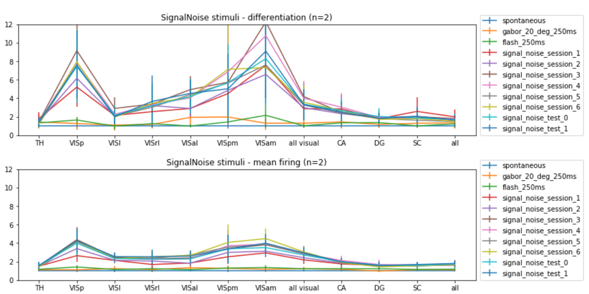

## Neurophysiological differentiation vs stimulus differentiation
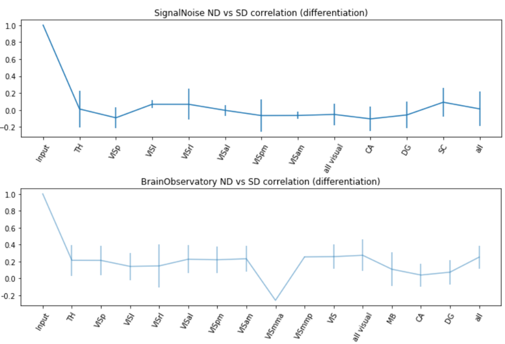

# Firing rate dependence of differentiation

## Differentiation increases super-lienarly with firing rate
The below plots are for a simple Poisson process, with 50 units. The firing rate of each unit is chosen in two ways as indicated below.

The takeaway is that differentiation increases super-linearly. This means that if region A has on average a higher firing propensity compared to region B (for both spontaneous and stimulus response), then even after normalizing by spontaneous differentiation, region B will show a higher differentiation comopared to region A, *simply due to a higher firing propensity*. Thus, we might want to normalize firing rates to see if anyting else besides FR contributes to the differences in differentiation observed across different regions.

### All units with identical mean firing rates
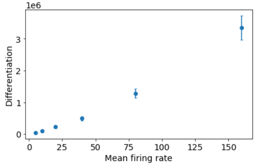

### Mean firing rates drawn from an exponential distribution
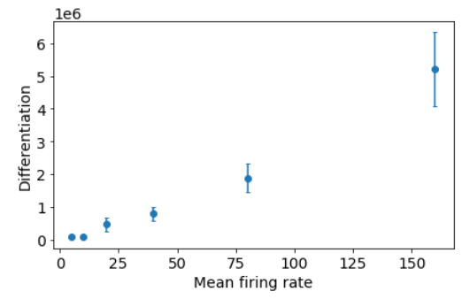

## Differentiation does not change much after shuffling units across sessions
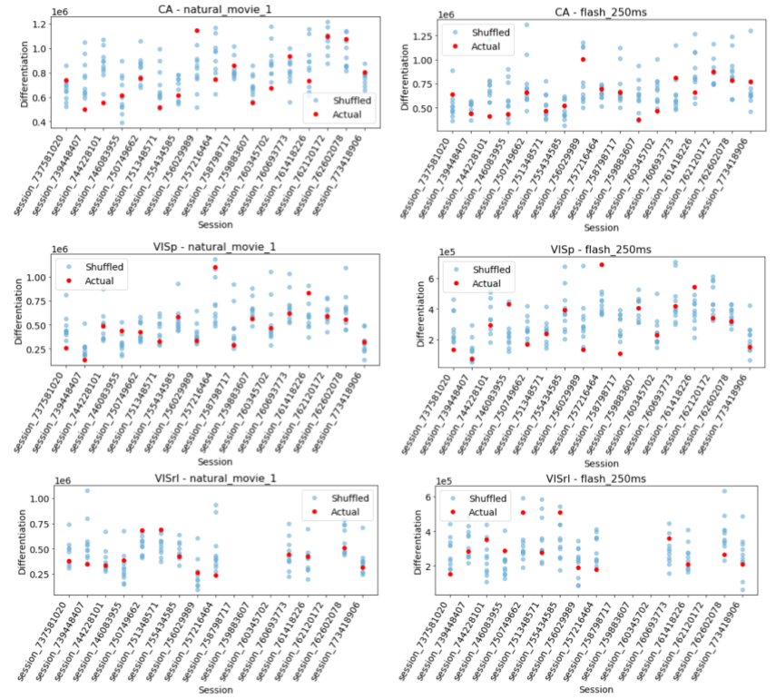

# Differentiation for shorter state, window lengths

## SignalNoise stimuli
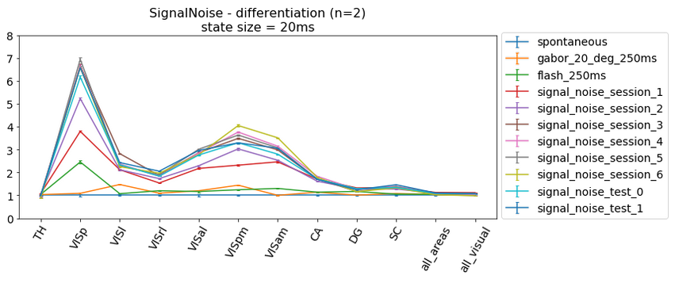
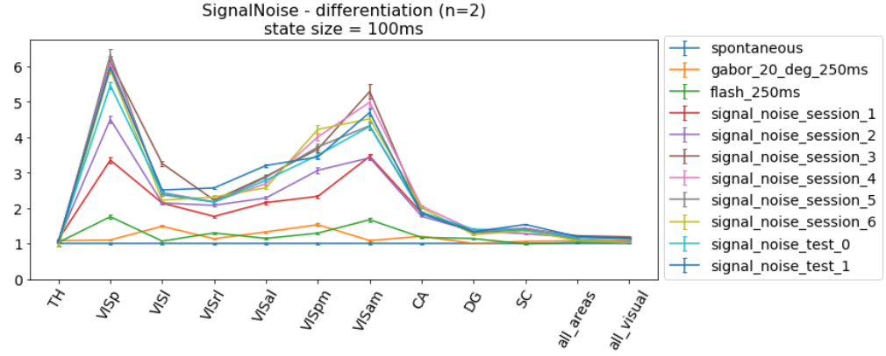
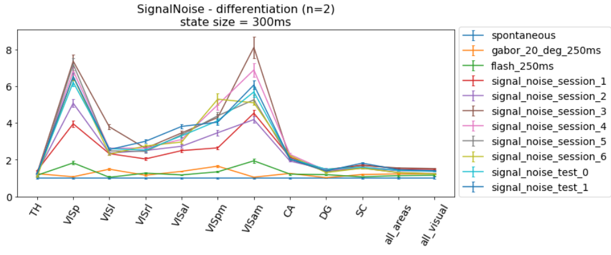
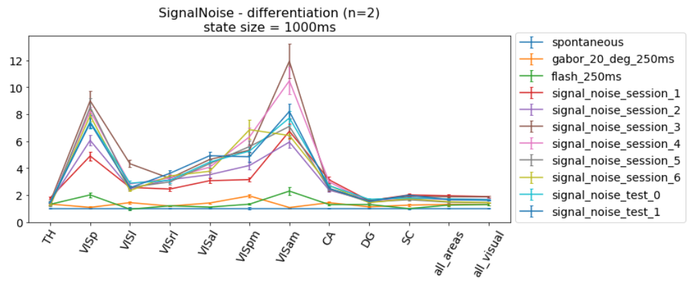

## BrainObservatory stimuli
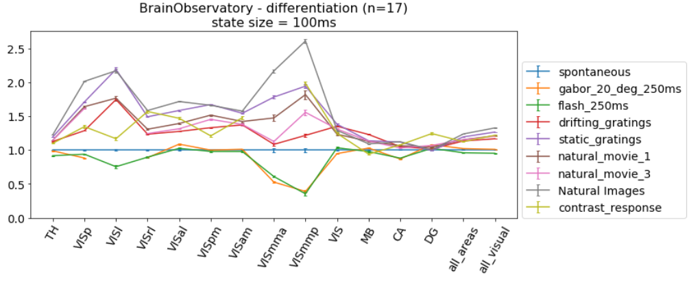
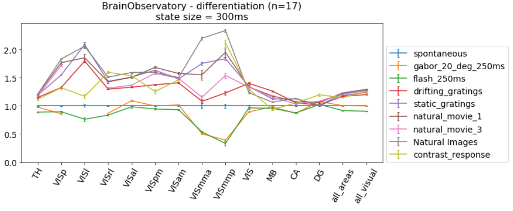
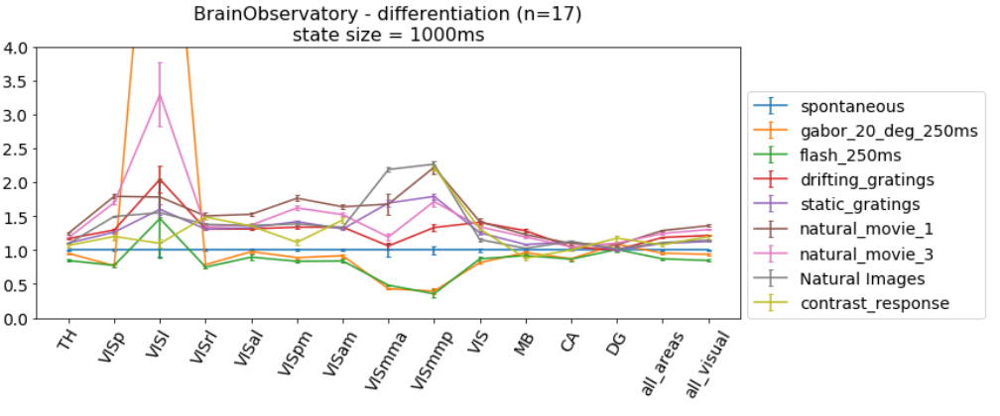