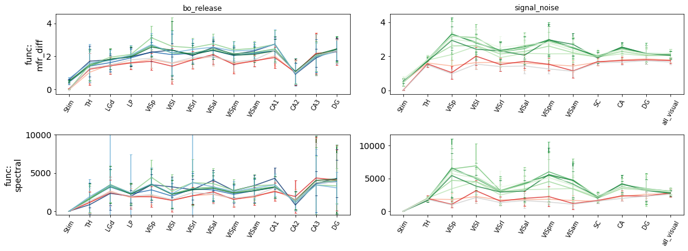
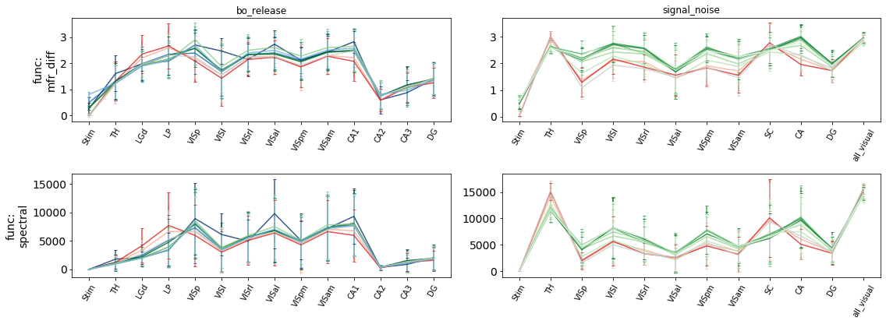
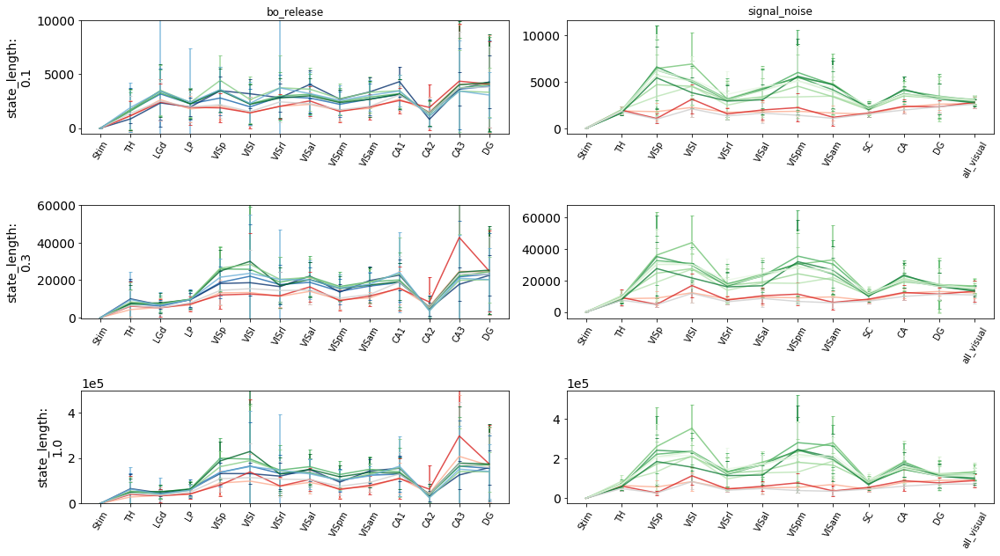
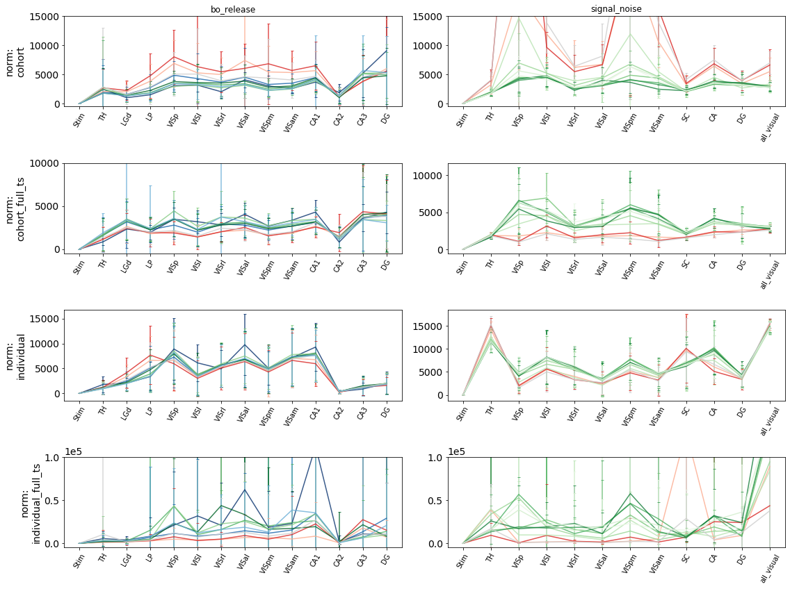

In this notebook, we load all the timeseries data for each session and split and plot it in different ways


```python
%load_ext autoreload
%autoreload 2
# %matplotlib widget
%matplotlib inline
```


```python
import os
from os import path
import pickle

import numpy as np
import pandas as pd
import matplotlib.pyplot as plt
import matplotlib.cm as cm
from tqdm.auto import tqdm

from differentiation import io
from differentiation.parsers import ecephys, stimulus
from differentiation.unitprops import UnitProps as UP

from meta import *
```

---
Useful helper functions


```python
def paint_stimulus_background(df, ax=None):
    used_labels = []
    if ax is None:
        f, ax = plt.subplots(1, 1)
    for block in set(df.block.dropna()):
        label = '_'
        stim = df[df.block==block].stimulus_name.values[0]
        if stim not in used_labels:
            used_labels.append(stim)
            label = stim
        start = min(df[df.block==block].time.values)
        stop = max(df.shift(-1)[df.block==block].time.values)
        ax.axvspan(start, stop, color=stimulus.stim_colors_bg.get(stim, cm.Greys(0.3, 0.3)), label=label)
```


```python
# load all relevant timeseries in a single dataframe for a  session, and create dict maps for other metainformation
# all timeseries split by region go under by_region, with their own names; all metadata such as running speed go under meta
l1columns = ['meta', 'collections']

# this dictionary maps each set from 'by_region' to it's metadata
metacollections = {} # each value is a dict(func, state_length, window_length, norm)

# this dictionary maps session name to session metadata
metasessions = {} # each value is a dict(source, modality)

def load_data(session):
    # load session metadata
    session_meta = io.load_metadata(session)
    metasessions[session] = {
        'source' : session_meta.get('session_type', 'undefined'),
        'modality' : session_meta.get('modality', 'undefined'),
    }
    # df with all timeseries data
    index = pd.MultiIndex(
        levels=[l1columns, [], regions],
        codes=[[], [], []],
        names=['type', 'set', 'region']
    )
    df = pd.DataFrame(columns=index)
    
    all_ts = io.list_timeseries(session, as_dataframe=True)
    
    for ts in all_ts.index:
        # skip certain timeseries
        if all_ts.type[ts] == 'activity':
            continue
        if ts == 'stimulus_frames':
            continue
        
        # temporary, to clean up unwanted data
        if all_ts.source[ts] == 'analysis/activity:0':
            print(ts)
            io.del_timeseries(session, ts)
            continue
        if ts in all_ts.state_length.dropna().index:
            # remove old diff copied over from sessions
            if ts not in all_ts.norm.dropna().index:
                print(ts)
                io.del_timeseries(session, ts)
                continue
        
        # check if timeseries is a differentiation timeseries or a metatimeseries
        if ts in all_ts.state_length.dropna().index:
            # check if metacollections has this kind of data
            series_meta = {
                'func' : all_ts.function[ts],
                'norm' : all_ts.norm[ts],
                'state_length' : all_ts.state_length[ts],
                'window_length' : all_ts.window_length[ts],
            }
            i = 0
            while i < len(metacollections):
                if metacollections['set_%d'%i] == series_meta:
                    break
                i += 1
            ts_name = 'set_%d'%i
            metacollections[ts_name] = series_meta
            
            if 'region' in all_ts.loc[ts, 'units']:
                region = all_ts.loc[ts, 'units'].split('+')[0].split(' == ')[1]
                if region not in regions:
                    continue
            else:
                region = 'Stim'
            
            ts_df, meta = io.load_timeseries(session, ts, as_dataframe=True)
            ts_df.set_index('time', inplace=True)
            ts_df.sort_index(inplace=True)
            ts_df.columns = [region]
            
            if len(ts_df) > len(df):
                if len(df) > 0:
                    df = df.reindex(ts_df.index, method='nearest')
            else:
                ts_df = ts_df.reindex(df.index, method='nearest')
            df[('collections', ts_name, ts_df.columns[0])] = ts_df.values[:, 0]
            df.index = ts_df.index
            
        # metatimeseries
        else:
            ts_df, meta = io.load_timeseries(session, ts, as_dataframe=True)
            ts_df.set_index('time', inplace=True)
            ts_df.sort_index(inplace=True)
            ts_df = ts_df.reindex(df.index, method='ffill')
            for col in ts_df.columns:
                df[('meta', col, '')] = ts_df[col]
        df[('meta', 'time', '')] = df.index
    
    return df.sort_index(axis=1, level=0, ascending=False)
```

TODO: align by stimulus onset

use `io.load_metadata(session, 'stimulus_frames')`


```python
# sessions = io.list_sessions(as_dataframe=True, meta={'modality' : 'neuropixels'})
# df_list = []
# for session in tqdm(sessions.index):
#     df_list.append(load_data(session))
# mega_df = pd.concat(df_list, keys=sessions.index).sort_index(axis=1, level=0, ascending=False)
# mega_df.to_pickle('../data/sessions/mega_df.pkl')
# with open('../data/sessions/mega_df_meta.pkl', 'wb') as f:
#     pickle.dump((metasessions, metacollections), f)
# mega_df.head()
```


```python
mega_df = pd.read_pickle('../data/sessions/mega_df.pkl')
with open('../data/sessions/mega_df_meta.pkl', 'rb') as f:
    metasessions, metacollections = pickle.load(f)
with open('../data/sessions/mega_df_up.pkl', 'rb') as f:
    unitprops = pickle.load(f)
mega_df.head(n=5)
```


<div>
<style scoped>
    .dataframe tbody tr th:only-of-type {
        vertical-align: middle;
    }

    .dataframe tbody tr th {
        vertical-align: top;
    }

    .dataframe thead tr th {
        text-align: left;
    }

    .dataframe thead tr:last-of-type th {
        text-align: right;
    }
</style>
<table border="1" class="dataframe">
  <thead>
    <tr>
      <th></th>
      <th>type</th>
      <th colspan="8" halign="left">meta</th>
      <th colspan="323" halign="left">collections</th>
    </tr>
    <tr>
      <th></th>
      <th>set</th>
      <th>time</th>
      <th>stimulus_name</th>
      <th>stimulus_condition</th>
      <th>running_speed</th>
      <th>repeat</th>
      <th>pupil_area</th>
      <th>eye_area</th>
      <th>block</th>
      <th colspan="17" halign="left">set_9</th>
      <th colspan="17" halign="left">set_8</th>
      <th colspan="17" halign="left">set_7</th>
      <th colspan="17" halign="left">set_6</th>
      <th colspan="17" halign="left">set_5</th>
      <th colspan="17" halign="left">set_4</th>
      <th colspan="17" halign="left">set_3</th>
      <th colspan="17" halign="left">set_2</th>
      <th colspan="17" halign="left">set_18</th>
      <th colspan="17" halign="left">set_17</th>
      <th colspan="17" halign="left">set_16</th>
      <th colspan="17" halign="left">set_15</th>
      <th colspan="17" halign="left">set_14</th>
      <th colspan="17" halign="left">set_13</th>
      <th colspan="17" halign="left">set_12</th>
      <th colspan="17" halign="left">set_11</th>
      <th colspan="17" halign="left">set_10</th>
      <th colspan="17" halign="left">set_1</th>
      <th colspan="17" halign="left">set_0</th>
    </tr>
    <tr>
      <th></th>
      <th>region</th>
      <th></th>
      <th></th>
      <th></th>
      <th></th>
      <th></th>
      <th></th>
      <th></th>
      <th></th>
      <th>all_visual</th>
      <th>VISrl</th>
      <th>VISpm</th>
      <th>VISp</th>
      <th>VISl</th>
      <th>VISam</th>
      <th>VISal</th>
      <th>TH</th>
      <th>Stim</th>
      <th>SC</th>
      <th>LP</th>
      <th>LGd</th>
      <th>DG</th>
      <th>CA3</th>
      <th>CA2</th>
      <th>CA1</th>
      <th>CA</th>
      <th>all_visual</th>
      <th>VISrl</th>
      <th>VISpm</th>
      <th>VISp</th>
      <th>VISl</th>
      <th>VISam</th>
      <th>VISal</th>
      <th>TH</th>
      <th>Stim</th>
      <th>SC</th>
      <th>LP</th>
      <th>LGd</th>
      <th>DG</th>
      <th>CA3</th>
      <th>CA2</th>
      <th>CA1</th>
      <th>CA</th>
      <th>all_visual</th>
      <th>VISrl</th>
      <th>VISpm</th>
      <th>VISp</th>
      <th>VISl</th>
      <th>VISam</th>
      <th>VISal</th>
      <th>TH</th>
      <th>Stim</th>
      <th>SC</th>
      <th>LP</th>
      <th>LGd</th>
      <th>DG</th>
      <th>CA3</th>
      <th>CA2</th>
      <th>CA1</th>
      <th>CA</th>
      <th>all_visual</th>
      <th>VISrl</th>
      <th>VISpm</th>
      <th>VISp</th>
      <th>VISl</th>
      <th>VISam</th>
      <th>VISal</th>
      <th>TH</th>
      <th>Stim</th>
      <th>SC</th>
      <th>LP</th>
      <th>LGd</th>
      <th>DG</th>
      <th>CA3</th>
      <th>CA2</th>
      <th>CA1</th>
      <th>CA</th>
      <th>all_visual</th>
      <th>VISrl</th>
      <th>VISpm</th>
      <th>VISp</th>
      <th>VISl</th>
      <th>VISam</th>
      <th>VISal</th>
      <th>TH</th>
      <th>Stim</th>
      <th>SC</th>
      <th>LP</th>
      <th>LGd</th>
      <th>DG</th>
      <th>CA3</th>
      <th>CA2</th>
      <th>CA1</th>
      <th>CA</th>
      <th>all_visual</th>
      <th>VISrl</th>
      <th>VISpm</th>
      <th>VISp</th>
      <th>VISl</th>
      <th>VISam</th>
      <th>VISal</th>
      <th>TH</th>
      <th>Stim</th>
      <th>SC</th>
      <th>LP</th>
      <th>LGd</th>
      <th>DG</th>
      <th>CA3</th>
      <th>CA2</th>
      <th>CA1</th>
      <th>CA</th>
      <th>all_visual</th>
      <th>VISrl</th>
      <th>VISpm</th>
      <th>VISp</th>
      <th>VISl</th>
      <th>VISam</th>
      <th>VISal</th>
      <th>TH</th>
      <th>Stim</th>
      <th>SC</th>
      <th>LP</th>
      <th>LGd</th>
      <th>DG</th>
      <th>CA3</th>
      <th>CA2</th>
      <th>CA1</th>
      <th>CA</th>
      <th>all_visual</th>
      <th>VISrl</th>
      <th>VISpm</th>
      <th>VISp</th>
      <th>VISl</th>
      <th>VISam</th>
      <th>VISal</th>
      <th>TH</th>
      <th>Stim</th>
      <th>SC</th>
      <th>LP</th>
      <th>LGd</th>
      <th>DG</th>
      <th>CA3</th>
      <th>CA2</th>
      <th>CA1</th>
      <th>CA</th>
      <th>all_visual</th>
      <th>VISrl</th>
      <th>VISpm</th>
      <th>VISp</th>
      <th>VISl</th>
      <th>VISam</th>
      <th>VISal</th>
      <th>TH</th>
      <th>Stim</th>
      <th>SC</th>
      <th>LP</th>
      <th>LGd</th>
      <th>DG</th>
      <th>CA3</th>
      <th>CA2</th>
      <th>CA1</th>
      <th>CA</th>
      <th>all_visual</th>
      <th>VISrl</th>
      <th>VISpm</th>
      <th>VISp</th>
      <th>VISl</th>
      <th>VISam</th>
      <th>VISal</th>
      <th>TH</th>
      <th>Stim</th>
      <th>SC</th>
      <th>LP</th>
      <th>LGd</th>
      <th>DG</th>
      <th>CA3</th>
      <th>CA2</th>
      <th>CA1</th>
      <th>CA</th>
      <th>all_visual</th>
      <th>VISrl</th>
      <th>VISpm</th>
      <th>VISp</th>
      <th>VISl</th>
      <th>VISam</th>
      <th>VISal</th>
      <th>TH</th>
      <th>Stim</th>
      <th>SC</th>
      <th>LP</th>
      <th>LGd</th>
      <th>DG</th>
      <th>CA3</th>
      <th>CA2</th>
      <th>CA1</th>
      <th>CA</th>
      <th>all_visual</th>
      <th>VISrl</th>
      <th>VISpm</th>
      <th>VISp</th>
      <th>VISl</th>
      <th>VISam</th>
      <th>VISal</th>
      <th>TH</th>
      <th>Stim</th>
      <th>SC</th>
      <th>LP</th>
      <th>LGd</th>
      <th>DG</th>
      <th>CA3</th>
      <th>CA2</th>
      <th>CA1</th>
      <th>CA</th>
      <th>all_visual</th>
      <th>VISrl</th>
      <th>VISpm</th>
      <th>VISp</th>
      <th>VISl</th>
      <th>VISam</th>
      <th>VISal</th>
      <th>TH</th>
      <th>Stim</th>
      <th>SC</th>
      <th>LP</th>
      <th>LGd</th>
      <th>DG</th>
      <th>CA3</th>
      <th>CA2</th>
      <th>CA1</th>
      <th>CA</th>
      <th>all_visual</th>
      <th>VISrl</th>
      <th>VISpm</th>
      <th>VISp</th>
      <th>VISl</th>
      <th>VISam</th>
      <th>VISal</th>
      <th>TH</th>
      <th>Stim</th>
      <th>SC</th>
      <th>LP</th>
      <th>LGd</th>
      <th>DG</th>
      <th>CA3</th>
      <th>CA2</th>
      <th>CA1</th>
      <th>CA</th>
      <th>all_visual</th>
      <th>VISrl</th>
      <th>VISpm</th>
      <th>VISp</th>
      <th>VISl</th>
      <th>VISam</th>
      <th>VISal</th>
      <th>TH</th>
      <th>Stim</th>
      <th>SC</th>
      <th>LP</th>
      <th>LGd</th>
      <th>DG</th>
      <th>CA3</th>
      <th>CA2</th>
      <th>CA1</th>
      <th>CA</th>
      <th>all_visual</th>
      <th>VISrl</th>
      <th>VISpm</th>
      <th>VISp</th>
      <th>VISl</th>
      <th>VISam</th>
      <th>VISal</th>
      <th>TH</th>
      <th>Stim</th>
      <th>SC</th>
      <th>LP</th>
      <th>LGd</th>
      <th>DG</th>
      <th>CA3</th>
      <th>CA2</th>
      <th>CA1</th>
      <th>CA</th>
      <th>all_visual</th>
      <th>VISrl</th>
      <th>VISpm</th>
      <th>VISp</th>
      <th>VISl</th>
      <th>VISam</th>
      <th>VISal</th>
      <th>TH</th>
      <th>Stim</th>
      <th>SC</th>
      <th>LP</th>
      <th>LGd</th>
      <th>DG</th>
      <th>CA3</th>
      <th>CA2</th>
      <th>CA1</th>
      <th>CA</th>
      <th>all_visual</th>
      <th>VISrl</th>
      <th>VISpm</th>
      <th>VISp</th>
      <th>VISl</th>
      <th>VISam</th>
      <th>VISal</th>
      <th>TH</th>
      <th>Stim</th>
      <th>SC</th>
      <th>LP</th>
      <th>LGd</th>
      <th>DG</th>
      <th>CA3</th>
      <th>CA2</th>
      <th>CA1</th>
      <th>CA</th>
      <th>all_visual</th>
      <th>VISrl</th>
      <th>VISpm</th>
      <th>VISp</th>
      <th>VISl</th>
      <th>VISam</th>
      <th>VISal</th>
      <th>TH</th>
      <th>Stim</th>
      <th>SC</th>
      <th>LP</th>
      <th>LGd</th>
      <th>DG</th>
      <th>CA3</th>
      <th>CA2</th>
      <th>CA1</th>
      <th>CA</th>
    </tr>
    <tr>
      <th>name</th>
      <th>time</th>
      <th></th>
      <th></th>
      <th></th>
      <th></th>
      <th></th>
      <th></th>
      <th></th>
      <th></th>
      <th></th>
      <th></th>
      <th></th>
      <th></th>
      <th></th>
      <th></th>
      <th></th>
      <th></th>
      <th></th>
      <th></th>
      <th></th>
      <th></th>
      <th></th>
      <th></th>
      <th></th>
      <th></th>
      <th></th>
      <th></th>
      <th></th>
      <th></th>
      <th></th>
      <th></th>
      <th></th>
      <th></th>
      <th></th>
      <th></th>
      <th></th>
      <th></th>
      <th></th>
      <th></th>
      <th></th>
      <th></th>
      <th></th>
      <th></th>
      <th></th>
      <th></th>
      <th></th>
      <th></th>
      <th></th>
      <th></th>
      <th></th>
      <th></th>
      <th></th>
      <th></th>
      <th></th>
      <th></th>
      <th></th>
      <th></th>
      <th></th>
      <th></th>
      <th></th>
      <th></th>
      <th></th>
      <th></th>
      <th></th>
      <th></th>
      <th></th>
      <th></th>
      <th></th>
      <th></th>
      <th></th>
      <th></th>
      <th></th>
      <th></th>
      <th></th>
      <th></th>
      <th></th>
      <th></th>
      <th></th>
      <th></th>
      <th></th>
      <th></th>
      <th></th>
      <th></th>
      <th></th>
      <th></th>
      <th></th>
      <th></th>
      <th></th>
      <th></th>
      <th></th>
      <th></th>
      <th></th>
      <th></th>
      <th></th>
      <th></th>
      <th></th>
      <th></th>
      <th></th>
      <th></th>
      <th></th>
      <th></th>
      <th></th>
      <th></th>
      <th></th>
      <th></th>
      <th></th>
      <th></th>
      <th></th>
      <th></th>
      <th></th>
      <th></th>
      <th></th>
      <th></th>
      <th></th>
      <th></th>
      <th></th>
      <th></th>
      <th></th>
      <th></th>
      <th></th>
      <th></th>
      <th></th>
      <th></th>
      <th></th>
      <th></th>
      <th></th>
      <th></th>
      <th></th>
      <th></th>
      <th></th>
      <th></th>
      <th></th>
      <th></th>
      <th></th>
      <th></th>
      <th></th>
      <th></th>
      <th></th>
      <th></th>
      <th></th>
      <th></th>
      <th></th>
      <th></th>
      <th></th>
      <th></th>
      <th></th>
      <th></th>
      <th></th>
      <th></th>
      <th></th>
      <th></th>
      <th></th>
      <th></th>
      <th></th>
      <th></th>
      <th></th>
      <th></th>
      <th></th>
      <th></th>
      <th></th>
      <th></th>
      <th></th>
      <th></th>
      <th></th>
      <th></th>
      <th></th>
      <th></th>
      <th></th>
      <th></th>
      <th></th>
      <th></th>
      <th></th>
      <th></th>
      <th></th>
      <th></th>
      <th></th>
      <th></th>
      <th></th>
      <th></th>
      <th></th>
      <th></th>
      <th></th>
      <th></th>
      <th></th>
      <th></th>
      <th></th>
      <th></th>
      <th></th>
      <th></th>
      <th></th>
      <th></th>
      <th></th>
      <th></th>
      <th></th>
      <th></th>
      <th></th>
      <th></th>
      <th></th>
      <th></th>
      <th></th>
      <th></th>
      <th></th>
      <th></th>
      <th></th>
      <th></th>
      <th></th>
      <th></th>
      <th></th>
      <th></th>
      <th></th>
      <th></th>
      <th></th>
      <th></th>
      <th></th>
      <th></th>
      <th></th>
      <th></th>
      <th></th>
      <th></th>
      <th></th>
      <th></th>
      <th></th>
      <th></th>
      <th></th>
      <th></th>
      <th></th>
      <th></th>
      <th></th>
      <th></th>
      <th></th>
      <th></th>
      <th></th>
      <th></th>
      <th></th>
      <th></th>
      <th></th>
      <th></th>
      <th></th>
      <th></th>
      <th></th>
      <th></th>
      <th></th>
      <th></th>
      <th></th>
      <th></th>
      <th></th>
      <th></th>
      <th></th>
      <th></th>
      <th></th>
      <th></th>
      <th></th>
      <th></th>
      <th></th>
      <th></th>
      <th></th>
      <th></th>
      <th></th>
      <th></th>
      <th></th>
      <th></th>
      <th></th>
      <th></th>
      <th></th>
      <th></th>
      <th></th>
      <th></th>
      <th></th>
      <th></th>
      <th></th>
      <th></th>
      <th></th>
      <th></th>
      <th></th>
      <th></th>
      <th></th>
      <th></th>
      <th></th>
      <th></th>
      <th></th>
      <th></th>
      <th></th>
      <th></th>
      <th></th>
      <th></th>
      <th></th>
      <th></th>
      <th></th>
      <th></th>
      <th></th>
      <th></th>
      <th></th>
      <th></th>
      <th></th>
      <th></th>
      <th></th>
      <th></th>
      <th></th>
      <th></th>
      <th></th>
      <th></th>
      <th></th>
      <th></th>
      <th></th>
      <th></th>
      <th></th>
      <th></th>
      <th></th>
      <th></th>
      <th></th>
      <th></th>
      <th></th>
      <th></th>
      <th></th>
      <th></th>
      <th></th>
      <th></th>
      <th></th>
      <th></th>
      <th></th>
      <th></th>
      <th></th>
      <th></th>
      <th></th>
      <th></th>
      <th></th>
      <th></th>
      <th></th>
      <th></th>
      <th></th>
      <th></th>
      <th></th>
    </tr>
  </thead>
  <tbody>
    <tr>
      <td rowspan="5" valign="top">ecephys_session_737581020</td>
      <td>1.5</td>
      <td>1.5</td>
      <td>NaN</td>
      <td>NaN</td>
      <td>NaN</td>
      <td>NaN</td>
      <td>NaN</td>
      <td>NaN</td>
      <td>NaN</td>
      <td>NaN</td>
      <td>10077.882484</td>
      <td>2204.540769</td>
      <td>9092.103638</td>
      <td>0.0</td>
      <td>NaN</td>
      <td>NaN</td>
      <td>NaN</td>
      <td>0.0</td>
      <td>NaN</td>
      <td>NaN</td>
      <td>NaN</td>
      <td>NaN</td>
      <td>NaN</td>
      <td>NaN</td>
      <td>NaN</td>
      <td>NaN</td>
      <td>NaN</td>
      <td>13.910842</td>
      <td>6.488578</td>
      <td>8.188902</td>
      <td>0.0</td>
      <td>NaN</td>
      <td>NaN</td>
      <td>NaN</td>
      <td>0.0</td>
      <td>NaN</td>
      <td>NaN</td>
      <td>NaN</td>
      <td>NaN</td>
      <td>NaN</td>
      <td>NaN</td>
      <td>NaN</td>
      <td>NaN</td>
      <td>NaN</td>
      <td>3.473493</td>
      <td>2.635316</td>
      <td>6.520584</td>
      <td>0.0</td>
      <td>NaN</td>
      <td>NaN</td>
      <td>NaN</td>
      <td>0.0</td>
      <td>NaN</td>
      <td>NaN</td>
      <td>NaN</td>
      <td>NaN</td>
      <td>NaN</td>
      <td>NaN</td>
      <td>NaN</td>
      <td>NaN</td>
      <td>NaN</td>
      <td>11.713216</td>
      <td>7.851964</td>
      <td>14.368593</td>
      <td>NaN</td>
      <td>NaN</td>
      <td>NaN</td>
      <td>NaN</td>
      <td>0.0</td>
      <td>NaN</td>
      <td>NaN</td>
      <td>NaN</td>
      <td>NaN</td>
      <td>NaN</td>
      <td>NaN</td>
      <td>NaN</td>
      <td>NaN</td>
      <td>NaN</td>
      <td>9.764315</td>
      <td>2.010875</td>
      <td>7.065679</td>
      <td>0.0</td>
      <td>NaN</td>
      <td>NaN</td>
      <td>NaN</td>
      <td>0.0</td>
      <td>NaN</td>
      <td>NaN</td>
      <td>NaN</td>
      <td>NaN</td>
      <td>NaN</td>
      <td>NaN</td>
      <td>NaN</td>
      <td>NaN</td>
      <td>NaN</td>
      <td>3.989420</td>
      <td>2.835148</td>
      <td>5.019548</td>
      <td>0.0</td>
      <td>NaN</td>
      <td>NaN</td>
      <td>NaN</td>
      <td>0.0</td>
      <td>NaN</td>
      <td>NaN</td>
      <td>NaN</td>
      <td>NaN</td>
      <td>NaN</td>
      <td>NaN</td>
      <td>NaN</td>
      <td>NaN</td>
      <td>NaN</td>
      <td>17.470178</td>
      <td>10.091988</td>
      <td>18.785942</td>
      <td>NaN</td>
      <td>NaN</td>
      <td>NaN</td>
      <td>NaN</td>
      <td>0.0</td>
      <td>NaN</td>
      <td>NaN</td>
      <td>NaN</td>
      <td>NaN</td>
      <td>NaN</td>
      <td>NaN</td>
      <td>NaN</td>
      <td>NaN</td>
      <td>NaN</td>
      <td>8.357143</td>
      <td>3.000000</td>
      <td>7.681146</td>
      <td>0.0</td>
      <td>NaN</td>
      <td>NaN</td>
      <td>NaN</td>
      <td>0.0</td>
      <td>NaN</td>
      <td>NaN</td>
      <td>NaN</td>
      <td>NaN</td>
      <td>NaN</td>
      <td>NaN</td>
      <td>NaN</td>
      <td>NaN</td>
      <td>NaN</td>
      <td>2.030080e+06</td>
      <td>1.345360e+06</td>
      <td>3.529923e+06</td>
      <td>NaN</td>
      <td>NaN</td>
      <td>NaN</td>
      <td>NaN</td>
      <td>0.0</td>
      <td>NaN</td>
      <td>NaN</td>
      <td>NaN</td>
      <td>NaN</td>
      <td>NaN</td>
      <td>NaN</td>
      <td>NaN</td>
      <td>NaN</td>
      <td>NaN</td>
      <td>419679.092939</td>
      <td>261843.054403</td>
      <td>735837.421185</td>
      <td>NaN</td>
      <td>NaN</td>
      <td>NaN</td>
      <td>NaN</td>
      <td>0.0</td>
      <td>NaN</td>
      <td>NaN</td>
      <td>NaN</td>
      <td>NaN</td>
      <td>NaN</td>
      <td>NaN</td>
      <td>NaN</td>
      <td>NaN</td>
      <td>NaN</td>
      <td>98407.999217</td>
      <td>196639.593240</td>
      <td>272307.782306</td>
      <td>NaN</td>
      <td>NaN</td>
      <td>NaN</td>
      <td>NaN</td>
      <td>0.0</td>
      <td>NaN</td>
      <td>NaN</td>
      <td>NaN</td>
      <td>NaN</td>
      <td>NaN</td>
      <td>NaN</td>
      <td>NaN</td>
      <td>NaN</td>
      <td>NaN</td>
      <td>178522.820337</td>
      <td>151546.958801</td>
      <td>726958.600195</td>
      <td>0.0</td>
      <td>NaN</td>
      <td>NaN</td>
      <td>NaN</td>
      <td>0.0</td>
      <td>NaN</td>
      <td>NaN</td>
      <td>NaN</td>
      <td>NaN</td>
      <td>NaN</td>
      <td>NaN</td>
      <td>NaN</td>
      <td>NaN</td>
      <td>NaN</td>
      <td>6.418885e+06</td>
      <td>1.580459e+06</td>
      <td>2.771090e+06</td>
      <td>0.0</td>
      <td>NaN</td>
      <td>NaN</td>
      <td>NaN</td>
      <td>0.0</td>
      <td>NaN</td>
      <td>NaN</td>
      <td>NaN</td>
      <td>NaN</td>
      <td>NaN</td>
      <td>NaN</td>
      <td>NaN</td>
      <td>NaN</td>
      <td>NaN</td>
      <td>21884.783222</td>
      <td>20665.180438</td>
      <td>52534.559751</td>
      <td>0.0</td>
      <td>NaN</td>
      <td>NaN</td>
      <td>NaN</td>
      <td>0.0</td>
      <td>NaN</td>
      <td>NaN</td>
      <td>NaN</td>
      <td>NaN</td>
      <td>NaN</td>
      <td>NaN</td>
      <td>NaN</td>
      <td>NaN</td>
      <td>NaN</td>
      <td>208736.591432</td>
      <td>8882.056215</td>
      <td>85940.709315</td>
      <td>0.0</td>
      <td>NaN</td>
      <td>NaN</td>
      <td>NaN</td>
      <td>0.0</td>
      <td>NaN</td>
      <td>NaN</td>
      <td>NaN</td>
      <td>NaN</td>
      <td>NaN</td>
      <td>NaN</td>
      <td>NaN</td>
      <td>NaN</td>
      <td>NaN</td>
      <td>4302.747049</td>
      <td>81.648095</td>
      <td>2801.163695</td>
      <td>0.0</td>
      <td>NaN</td>
      <td>NaN</td>
      <td>NaN</td>
      <td>0.0</td>
      <td>NaN</td>
      <td>NaN</td>
      <td>NaN</td>
      <td>NaN</td>
      <td>NaN</td>
      <td>NaN</td>
      <td>NaN</td>
      <td>NaN</td>
      <td>NaN</td>
      <td>3100.295099</td>
      <td>882.800965</td>
      <td>2038.741499</td>
      <td>0.0</td>
      <td>NaN</td>
      <td>NaN</td>
      <td>NaN</td>
      <td>0.0</td>
      <td>NaN</td>
      <td>NaN</td>
      <td>NaN</td>
      <td>NaN</td>
      <td>NaN</td>
      <td>NaN</td>
      <td>NaN</td>
      <td>NaN</td>
      <td>NaN</td>
      <td>6.638797</td>
      <td>3.803751</td>
      <td>6.520584</td>
      <td>0.0</td>
      <td>NaN</td>
      <td>NaN</td>
      <td>NaN</td>
      <td>0.0</td>
      <td>NaN</td>
      <td>NaN</td>
      <td>NaN</td>
      <td>NaN</td>
      <td>NaN</td>
      <td>NaN</td>
      <td>NaN</td>
      <td>NaN</td>
      <td>NaN</td>
      <td>30.251873</td>
      <td>28.333333</td>
      <td>38.001712</td>
      <td>NaN</td>
      <td>NaN</td>
      <td>NaN</td>
      <td>NaN</td>
      <td>0.0</td>
      <td>NaN</td>
      <td>NaN</td>
      <td>NaN</td>
      <td>NaN</td>
      <td>NaN</td>
      <td>NaN</td>
      <td>NaN</td>
      <td>NaN</td>
    </tr>
    <tr>
      <td>4.5</td>
      <td>4.5</td>
      <td>NaN</td>
      <td>NaN</td>
      <td>NaN</td>
      <td>NaN</td>
      <td>NaN</td>
      <td>NaN</td>
      <td>NaN</td>
      <td>NaN</td>
      <td>8976.420420</td>
      <td>1530.931089</td>
      <td>6202.503922</td>
      <td>0.0</td>
      <td>NaN</td>
      <td>NaN</td>
      <td>NaN</td>
      <td>0.0</td>
      <td>NaN</td>
      <td>NaN</td>
      <td>NaN</td>
      <td>NaN</td>
      <td>NaN</td>
      <td>NaN</td>
      <td>NaN</td>
      <td>NaN</td>
      <td>NaN</td>
      <td>13.910842</td>
      <td>6.488578</td>
      <td>8.188902</td>
      <td>0.0</td>
      <td>NaN</td>
      <td>NaN</td>
      <td>NaN</td>
      <td>0.0</td>
      <td>NaN</td>
      <td>NaN</td>
      <td>NaN</td>
      <td>NaN</td>
      <td>NaN</td>
      <td>NaN</td>
      <td>NaN</td>
      <td>NaN</td>
      <td>NaN</td>
      <td>3.473493</td>
      <td>2.635316</td>
      <td>6.520584</td>
      <td>0.0</td>
      <td>NaN</td>
      <td>NaN</td>
      <td>NaN</td>
      <td>0.0</td>
      <td>NaN</td>
      <td>NaN</td>
      <td>NaN</td>
      <td>NaN</td>
      <td>NaN</td>
      <td>NaN</td>
      <td>NaN</td>
      <td>NaN</td>
      <td>NaN</td>
      <td>11.713216</td>
      <td>7.851964</td>
      <td>14.368593</td>
      <td>NaN</td>
      <td>NaN</td>
      <td>NaN</td>
      <td>NaN</td>
      <td>0.0</td>
      <td>NaN</td>
      <td>NaN</td>
      <td>NaN</td>
      <td>NaN</td>
      <td>NaN</td>
      <td>NaN</td>
      <td>NaN</td>
      <td>NaN</td>
      <td>NaN</td>
      <td>9.764315</td>
      <td>2.010875</td>
      <td>7.065679</td>
      <td>0.0</td>
      <td>NaN</td>
      <td>NaN</td>
      <td>NaN</td>
      <td>0.0</td>
      <td>NaN</td>
      <td>NaN</td>
      <td>NaN</td>
      <td>NaN</td>
      <td>NaN</td>
      <td>NaN</td>
      <td>NaN</td>
      <td>NaN</td>
      <td>NaN</td>
      <td>3.989420</td>
      <td>2.835148</td>
      <td>5.019548</td>
      <td>0.0</td>
      <td>NaN</td>
      <td>NaN</td>
      <td>NaN</td>
      <td>0.0</td>
      <td>NaN</td>
      <td>NaN</td>
      <td>NaN</td>
      <td>NaN</td>
      <td>NaN</td>
      <td>NaN</td>
      <td>NaN</td>
      <td>NaN</td>
      <td>NaN</td>
      <td>17.470178</td>
      <td>10.091988</td>
      <td>18.785942</td>
      <td>NaN</td>
      <td>NaN</td>
      <td>NaN</td>
      <td>NaN</td>
      <td>0.0</td>
      <td>NaN</td>
      <td>NaN</td>
      <td>NaN</td>
      <td>NaN</td>
      <td>NaN</td>
      <td>NaN</td>
      <td>NaN</td>
      <td>NaN</td>
      <td>NaN</td>
      <td>7.403605</td>
      <td>2.500000</td>
      <td>5.590936</td>
      <td>0.0</td>
      <td>NaN</td>
      <td>NaN</td>
      <td>NaN</td>
      <td>0.0</td>
      <td>NaN</td>
      <td>NaN</td>
      <td>NaN</td>
      <td>NaN</td>
      <td>NaN</td>
      <td>NaN</td>
      <td>NaN</td>
      <td>NaN</td>
      <td>NaN</td>
      <td>2.030080e+06</td>
      <td>1.345360e+06</td>
      <td>3.529923e+06</td>
      <td>NaN</td>
      <td>NaN</td>
      <td>NaN</td>
      <td>NaN</td>
      <td>0.0</td>
      <td>NaN</td>
      <td>NaN</td>
      <td>NaN</td>
      <td>NaN</td>
      <td>NaN</td>
      <td>NaN</td>
      <td>NaN</td>
      <td>NaN</td>
      <td>NaN</td>
      <td>419679.092939</td>
      <td>261843.054403</td>
      <td>735837.421185</td>
      <td>NaN</td>
      <td>NaN</td>
      <td>NaN</td>
      <td>NaN</td>
      <td>0.0</td>
      <td>NaN</td>
      <td>NaN</td>
      <td>NaN</td>
      <td>NaN</td>
      <td>NaN</td>
      <td>NaN</td>
      <td>NaN</td>
      <td>NaN</td>
      <td>NaN</td>
      <td>104816.786671</td>
      <td>75756.513924</td>
      <td>155765.085137</td>
      <td>NaN</td>
      <td>NaN</td>
      <td>NaN</td>
      <td>NaN</td>
      <td>0.0</td>
      <td>NaN</td>
      <td>NaN</td>
      <td>NaN</td>
      <td>NaN</td>
      <td>NaN</td>
      <td>NaN</td>
      <td>NaN</td>
      <td>NaN</td>
      <td>NaN</td>
      <td>178522.820337</td>
      <td>151546.958801</td>
      <td>726958.600195</td>
      <td>0.0</td>
      <td>NaN</td>
      <td>NaN</td>
      <td>NaN</td>
      <td>0.0</td>
      <td>NaN</td>
      <td>NaN</td>
      <td>NaN</td>
      <td>NaN</td>
      <td>NaN</td>
      <td>NaN</td>
      <td>NaN</td>
      <td>NaN</td>
      <td>NaN</td>
      <td>6.418885e+06</td>
      <td>1.580459e+06</td>
      <td>2.771090e+06</td>
      <td>0.0</td>
      <td>NaN</td>
      <td>NaN</td>
      <td>NaN</td>
      <td>0.0</td>
      <td>NaN</td>
      <td>NaN</td>
      <td>NaN</td>
      <td>NaN</td>
      <td>NaN</td>
      <td>NaN</td>
      <td>NaN</td>
      <td>NaN</td>
      <td>NaN</td>
      <td>21884.783222</td>
      <td>20665.180438</td>
      <td>52534.559751</td>
      <td>0.0</td>
      <td>NaN</td>
      <td>NaN</td>
      <td>NaN</td>
      <td>0.0</td>
      <td>NaN</td>
      <td>NaN</td>
      <td>NaN</td>
      <td>NaN</td>
      <td>NaN</td>
      <td>NaN</td>
      <td>NaN</td>
      <td>NaN</td>
      <td>NaN</td>
      <td>208736.591432</td>
      <td>8882.056215</td>
      <td>85940.709315</td>
      <td>0.0</td>
      <td>NaN</td>
      <td>NaN</td>
      <td>NaN</td>
      <td>0.0</td>
      <td>NaN</td>
      <td>NaN</td>
      <td>NaN</td>
      <td>NaN</td>
      <td>NaN</td>
      <td>NaN</td>
      <td>NaN</td>
      <td>NaN</td>
      <td>NaN</td>
      <td>4209.469788</td>
      <td>658.656704</td>
      <td>3082.257310</td>
      <td>0.0</td>
      <td>NaN</td>
      <td>NaN</td>
      <td>NaN</td>
      <td>0.0</td>
      <td>NaN</td>
      <td>NaN</td>
      <td>NaN</td>
      <td>NaN</td>
      <td>NaN</td>
      <td>NaN</td>
      <td>NaN</td>
      <td>NaN</td>
      <td>NaN</td>
      <td>2496.938194</td>
      <td>882.800965</td>
      <td>2444.365187</td>
      <td>0.0</td>
      <td>NaN</td>
      <td>NaN</td>
      <td>NaN</td>
      <td>0.0</td>
      <td>NaN</td>
      <td>NaN</td>
      <td>NaN</td>
      <td>NaN</td>
      <td>NaN</td>
      <td>NaN</td>
      <td>NaN</td>
      <td>NaN</td>
      <td>NaN</td>
      <td>4.694338</td>
      <td>3.803751</td>
      <td>6.520584</td>
      <td>0.0</td>
      <td>NaN</td>
      <td>NaN</td>
      <td>NaN</td>
      <td>0.0</td>
      <td>NaN</td>
      <td>NaN</td>
      <td>NaN</td>
      <td>NaN</td>
      <td>NaN</td>
      <td>NaN</td>
      <td>NaN</td>
      <td>NaN</td>
      <td>NaN</td>
      <td>24.600000</td>
      <td>17.586207</td>
      <td>26.248605</td>
      <td>NaN</td>
      <td>NaN</td>
      <td>NaN</td>
      <td>NaN</td>
      <td>0.0</td>
      <td>NaN</td>
      <td>NaN</td>
      <td>NaN</td>
      <td>NaN</td>
      <td>NaN</td>
      <td>NaN</td>
      <td>NaN</td>
      <td>NaN</td>
    </tr>
    <tr>
      <td>7.5</td>
      <td>7.5</td>
      <td>NaN</td>
      <td>NaN</td>
      <td>NaN</td>
      <td>NaN</td>
      <td>NaN</td>
      <td>NaN</td>
      <td>NaN</td>
      <td>NaN</td>
      <td>34602.591455</td>
      <td>2683.980253</td>
      <td>13850.173617</td>
      <td>0.0</td>
      <td>NaN</td>
      <td>NaN</td>
      <td>NaN</td>
      <td>0.0</td>
      <td>NaN</td>
      <td>NaN</td>
      <td>NaN</td>
      <td>NaN</td>
      <td>NaN</td>
      <td>NaN</td>
      <td>NaN</td>
      <td>NaN</td>
      <td>NaN</td>
      <td>13.910842</td>
      <td>6.488578</td>
      <td>8.188902</td>
      <td>0.0</td>
      <td>NaN</td>
      <td>NaN</td>
      <td>NaN</td>
      <td>0.0</td>
      <td>NaN</td>
      <td>NaN</td>
      <td>NaN</td>
      <td>NaN</td>
      <td>NaN</td>
      <td>NaN</td>
      <td>NaN</td>
      <td>NaN</td>
      <td>NaN</td>
      <td>3.473493</td>
      <td>2.635316</td>
      <td>6.520584</td>
      <td>0.0</td>
      <td>NaN</td>
      <td>NaN</td>
      <td>NaN</td>
      <td>0.0</td>
      <td>NaN</td>
      <td>NaN</td>
      <td>NaN</td>
      <td>NaN</td>
      <td>NaN</td>
      <td>NaN</td>
      <td>NaN</td>
      <td>NaN</td>
      <td>NaN</td>
      <td>11.713216</td>
      <td>7.851964</td>
      <td>14.368593</td>
      <td>NaN</td>
      <td>NaN</td>
      <td>NaN</td>
      <td>NaN</td>
      <td>0.0</td>
      <td>NaN</td>
      <td>NaN</td>
      <td>NaN</td>
      <td>NaN</td>
      <td>NaN</td>
      <td>NaN</td>
      <td>NaN</td>
      <td>NaN</td>
      <td>NaN</td>
      <td>9.764315</td>
      <td>2.010875</td>
      <td>7.065679</td>
      <td>0.0</td>
      <td>NaN</td>
      <td>NaN</td>
      <td>NaN</td>
      <td>0.0</td>
      <td>NaN</td>
      <td>NaN</td>
      <td>NaN</td>
      <td>NaN</td>
      <td>NaN</td>
      <td>NaN</td>
      <td>NaN</td>
      <td>NaN</td>
      <td>NaN</td>
      <td>3.989420</td>
      <td>2.835148</td>
      <td>5.019548</td>
      <td>0.0</td>
      <td>NaN</td>
      <td>NaN</td>
      <td>NaN</td>
      <td>0.0</td>
      <td>NaN</td>
      <td>NaN</td>
      <td>NaN</td>
      <td>NaN</td>
      <td>NaN</td>
      <td>NaN</td>
      <td>NaN</td>
      <td>NaN</td>
      <td>NaN</td>
      <td>17.470178</td>
      <td>10.091988</td>
      <td>18.785942</td>
      <td>NaN</td>
      <td>NaN</td>
      <td>NaN</td>
      <td>NaN</td>
      <td>0.0</td>
      <td>NaN</td>
      <td>NaN</td>
      <td>NaN</td>
      <td>NaN</td>
      <td>NaN</td>
      <td>NaN</td>
      <td>NaN</td>
      <td>NaN</td>
      <td>NaN</td>
      <td>15.098276</td>
      <td>3.905125</td>
      <td>8.112117</td>
      <td>0.0</td>
      <td>NaN</td>
      <td>NaN</td>
      <td>NaN</td>
      <td>0.0</td>
      <td>NaN</td>
      <td>NaN</td>
      <td>NaN</td>
      <td>NaN</td>
      <td>NaN</td>
      <td>NaN</td>
      <td>NaN</td>
      <td>NaN</td>
      <td>NaN</td>
      <td>2.030080e+06</td>
      <td>1.345360e+06</td>
      <td>3.529923e+06</td>
      <td>NaN</td>
      <td>NaN</td>
      <td>NaN</td>
      <td>NaN</td>
      <td>0.0</td>
      <td>NaN</td>
      <td>NaN</td>
      <td>NaN</td>
      <td>NaN</td>
      <td>NaN</td>
      <td>NaN</td>
      <td>NaN</td>
      <td>NaN</td>
      <td>NaN</td>
      <td>419679.092939</td>
      <td>261843.054403</td>
      <td>735837.421185</td>
      <td>NaN</td>
      <td>NaN</td>
      <td>NaN</td>
      <td>NaN</td>
      <td>0.0</td>
      <td>NaN</td>
      <td>NaN</td>
      <td>NaN</td>
      <td>NaN</td>
      <td>NaN</td>
      <td>NaN</td>
      <td>NaN</td>
      <td>NaN</td>
      <td>NaN</td>
      <td>65257.469968</td>
      <td>26703.456426</td>
      <td>94368.284347</td>
      <td>NaN</td>
      <td>NaN</td>
      <td>NaN</td>
      <td>NaN</td>
      <td>0.0</td>
      <td>NaN</td>
      <td>NaN</td>
      <td>NaN</td>
      <td>NaN</td>
      <td>NaN</td>
      <td>NaN</td>
      <td>NaN</td>
      <td>NaN</td>
      <td>NaN</td>
      <td>178522.820337</td>
      <td>151546.958801</td>
      <td>726958.600195</td>
      <td>0.0</td>
      <td>NaN</td>
      <td>NaN</td>
      <td>NaN</td>
      <td>0.0</td>
      <td>NaN</td>
      <td>NaN</td>
      <td>NaN</td>
      <td>NaN</td>
      <td>NaN</td>
      <td>NaN</td>
      <td>NaN</td>
      <td>NaN</td>
      <td>NaN</td>
      <td>6.418885e+06</td>
      <td>1.580459e+06</td>
      <td>2.771090e+06</td>
      <td>0.0</td>
      <td>NaN</td>
      <td>NaN</td>
      <td>NaN</td>
      <td>0.0</td>
      <td>NaN</td>
      <td>NaN</td>
      <td>NaN</td>
      <td>NaN</td>
      <td>NaN</td>
      <td>NaN</td>
      <td>NaN</td>
      <td>NaN</td>
      <td>NaN</td>
      <td>21884.783222</td>
      <td>20665.180438</td>
      <td>52534.559751</td>
      <td>0.0</td>
      <td>NaN</td>
      <td>NaN</td>
      <td>NaN</td>
      <td>0.0</td>
      <td>NaN</td>
      <td>NaN</td>
      <td>NaN</td>
      <td>NaN</td>
      <td>NaN</td>
      <td>NaN</td>
      <td>NaN</td>
      <td>NaN</td>
      <td>NaN</td>
      <td>208736.591432</td>
      <td>8882.056215</td>
      <td>85940.709315</td>
      <td>0.0</td>
      <td>NaN</td>
      <td>NaN</td>
      <td>NaN</td>
      <td>0.0</td>
      <td>NaN</td>
      <td>NaN</td>
      <td>NaN</td>
      <td>NaN</td>
      <td>NaN</td>
      <td>NaN</td>
      <td>NaN</td>
      <td>NaN</td>
      <td>NaN</td>
      <td>4370.402257</td>
      <td>1523.781561</td>
      <td>2961.092554</td>
      <td>0.0</td>
      <td>NaN</td>
      <td>NaN</td>
      <td>NaN</td>
      <td>0.0</td>
      <td>NaN</td>
      <td>NaN</td>
      <td>NaN</td>
      <td>NaN</td>
      <td>NaN</td>
      <td>NaN</td>
      <td>NaN</td>
      <td>NaN</td>
      <td>NaN</td>
      <td>3223.533348</td>
      <td>1611.766674</td>
      <td>3494.226883</td>
      <td>0.0</td>
      <td>NaN</td>
      <td>NaN</td>
      <td>NaN</td>
      <td>0.0</td>
      <td>NaN</td>
      <td>NaN</td>
      <td>NaN</td>
      <td>NaN</td>
      <td>NaN</td>
      <td>NaN</td>
      <td>NaN</td>
      <td>NaN</td>
      <td>NaN</td>
      <td>6.210026</td>
      <td>5.379316</td>
      <td>9.221498</td>
      <td>0.0</td>
      <td>NaN</td>
      <td>NaN</td>
      <td>NaN</td>
      <td>0.0</td>
      <td>NaN</td>
      <td>NaN</td>
      <td>NaN</td>
      <td>NaN</td>
      <td>NaN</td>
      <td>NaN</td>
      <td>NaN</td>
      <td>NaN</td>
      <td>NaN</td>
      <td>22.599126</td>
      <td>10.928014</td>
      <td>24.166107</td>
      <td>NaN</td>
      <td>NaN</td>
      <td>NaN</td>
      <td>NaN</td>
      <td>0.0</td>
      <td>NaN</td>
      <td>NaN</td>
      <td>NaN</td>
      <td>NaN</td>
      <td>NaN</td>
      <td>NaN</td>
      <td>NaN</td>
      <td>NaN</td>
    </tr>
    <tr>
      <td>10.5</td>
      <td>10.5</td>
      <td>NaN</td>
      <td>NaN</td>
      <td>NaN</td>
      <td>NaN</td>
      <td>NaN</td>
      <td>NaN</td>
      <td>NaN</td>
      <td>NaN</td>
      <td>11395.095400</td>
      <td>610.676113</td>
      <td>3025.470590</td>
      <td>0.0</td>
      <td>NaN</td>
      <td>NaN</td>
      <td>NaN</td>
      <td>0.0</td>
      <td>NaN</td>
      <td>NaN</td>
      <td>NaN</td>
      <td>NaN</td>
      <td>NaN</td>
      <td>NaN</td>
      <td>NaN</td>
      <td>NaN</td>
      <td>NaN</td>
      <td>13.910842</td>
      <td>6.488578</td>
      <td>8.188902</td>
      <td>0.0</td>
      <td>NaN</td>
      <td>NaN</td>
      <td>NaN</td>
      <td>0.0</td>
      <td>NaN</td>
      <td>NaN</td>
      <td>NaN</td>
      <td>NaN</td>
      <td>NaN</td>
      <td>NaN</td>
      <td>NaN</td>
      <td>NaN</td>
      <td>NaN</td>
      <td>3.473493</td>
      <td>2.635316</td>
      <td>6.520584</td>
      <td>0.0</td>
      <td>NaN</td>
      <td>NaN</td>
      <td>NaN</td>
      <td>0.0</td>
      <td>NaN</td>
      <td>NaN</td>
      <td>NaN</td>
      <td>NaN</td>
      <td>NaN</td>
      <td>NaN</td>
      <td>NaN</td>
      <td>NaN</td>
      <td>NaN</td>
      <td>11.713216</td>
      <td>7.851964</td>
      <td>14.368593</td>
      <td>NaN</td>
      <td>NaN</td>
      <td>NaN</td>
      <td>NaN</td>
      <td>0.0</td>
      <td>NaN</td>
      <td>NaN</td>
      <td>NaN</td>
      <td>NaN</td>
      <td>NaN</td>
      <td>NaN</td>
      <td>NaN</td>
      <td>NaN</td>
      <td>NaN</td>
      <td>16.605366</td>
      <td>4.811644</td>
      <td>9.153497</td>
      <td>0.0</td>
      <td>NaN</td>
      <td>NaN</td>
      <td>NaN</td>
      <td>0.0</td>
      <td>NaN</td>
      <td>NaN</td>
      <td>NaN</td>
      <td>NaN</td>
      <td>NaN</td>
      <td>NaN</td>
      <td>NaN</td>
      <td>NaN</td>
      <td>NaN</td>
      <td>5.420555</td>
      <td>4.744111</td>
      <td>8.784209</td>
      <td>0.0</td>
      <td>NaN</td>
      <td>NaN</td>
      <td>NaN</td>
      <td>0.0</td>
      <td>NaN</td>
      <td>NaN</td>
      <td>NaN</td>
      <td>NaN</td>
      <td>NaN</td>
      <td>NaN</td>
      <td>NaN</td>
      <td>NaN</td>
      <td>NaN</td>
      <td>16.139564</td>
      <td>9.735945</td>
      <td>16.952224</td>
      <td>NaN</td>
      <td>NaN</td>
      <td>NaN</td>
      <td>NaN</td>
      <td>0.0</td>
      <td>NaN</td>
      <td>NaN</td>
      <td>NaN</td>
      <td>NaN</td>
      <td>NaN</td>
      <td>NaN</td>
      <td>NaN</td>
      <td>NaN</td>
      <td>NaN</td>
      <td>9.002009</td>
      <td>1.578947</td>
      <td>4.755817</td>
      <td>0.0</td>
      <td>NaN</td>
      <td>NaN</td>
      <td>NaN</td>
      <td>0.0</td>
      <td>NaN</td>
      <td>NaN</td>
      <td>NaN</td>
      <td>NaN</td>
      <td>NaN</td>
      <td>NaN</td>
      <td>NaN</td>
      <td>NaN</td>
      <td>NaN</td>
      <td>2.030080e+06</td>
      <td>1.345360e+06</td>
      <td>3.529923e+06</td>
      <td>NaN</td>
      <td>NaN</td>
      <td>NaN</td>
      <td>NaN</td>
      <td>0.0</td>
      <td>NaN</td>
      <td>NaN</td>
      <td>NaN</td>
      <td>NaN</td>
      <td>NaN</td>
      <td>NaN</td>
      <td>NaN</td>
      <td>NaN</td>
      <td>NaN</td>
      <td>278522.417264</td>
      <td>142385.918221</td>
      <td>360710.045343</td>
      <td>NaN</td>
      <td>NaN</td>
      <td>NaN</td>
      <td>NaN</td>
      <td>0.0</td>
      <td>NaN</td>
      <td>NaN</td>
      <td>NaN</td>
      <td>NaN</td>
      <td>NaN</td>
      <td>NaN</td>
      <td>NaN</td>
      <td>NaN</td>
      <td>NaN</td>
      <td>98232.286340</td>
      <td>41887.724004</td>
      <td>93890.493266</td>
      <td>NaN</td>
      <td>NaN</td>
      <td>NaN</td>
      <td>NaN</td>
      <td>0.0</td>
      <td>NaN</td>
      <td>NaN</td>
      <td>NaN</td>
      <td>NaN</td>
      <td>NaN</td>
      <td>NaN</td>
      <td>NaN</td>
      <td>NaN</td>
      <td>NaN</td>
      <td>178522.820337</td>
      <td>151546.958801</td>
      <td>726958.600195</td>
      <td>0.0</td>
      <td>NaN</td>
      <td>NaN</td>
      <td>NaN</td>
      <td>0.0</td>
      <td>NaN</td>
      <td>NaN</td>
      <td>NaN</td>
      <td>NaN</td>
      <td>NaN</td>
      <td>NaN</td>
      <td>NaN</td>
      <td>NaN</td>
      <td>NaN</td>
      <td>6.418885e+06</td>
      <td>1.580459e+06</td>
      <td>2.771090e+06</td>
      <td>0.0</td>
      <td>NaN</td>
      <td>NaN</td>
      <td>NaN</td>
      <td>0.0</td>
      <td>NaN</td>
      <td>NaN</td>
      <td>NaN</td>
      <td>NaN</td>
      <td>NaN</td>
      <td>NaN</td>
      <td>NaN</td>
      <td>NaN</td>
      <td>NaN</td>
      <td>31416.949802</td>
      <td>33808.074702</td>
      <td>96852.351845</td>
      <td>0.0</td>
      <td>NaN</td>
      <td>NaN</td>
      <td>NaN</td>
      <td>0.0</td>
      <td>NaN</td>
      <td>NaN</td>
      <td>NaN</td>
      <td>NaN</td>
      <td>NaN</td>
      <td>NaN</td>
      <td>NaN</td>
      <td>NaN</td>
      <td>NaN</td>
      <td>810097.728234</td>
      <td>30660.419672</td>
      <td>205117.746101</td>
      <td>0.0</td>
      <td>NaN</td>
      <td>NaN</td>
      <td>NaN</td>
      <td>0.0</td>
      <td>NaN</td>
      <td>NaN</td>
      <td>NaN</td>
      <td>NaN</td>
      <td>NaN</td>
      <td>NaN</td>
      <td>NaN</td>
      <td>NaN</td>
      <td>NaN</td>
      <td>4214.806496</td>
      <td>81.648095</td>
      <td>7481.780054</td>
      <td>0.0</td>
      <td>NaN</td>
      <td>NaN</td>
      <td>NaN</td>
      <td>0.0</td>
      <td>NaN</td>
      <td>NaN</td>
      <td>NaN</td>
      <td>NaN</td>
      <td>NaN</td>
      <td>NaN</td>
      <td>NaN</td>
      <td>NaN</td>
      <td>NaN</td>
      <td>2883.215877</td>
      <td>882.800965</td>
      <td>4472.471011</td>
      <td>0.0</td>
      <td>NaN</td>
      <td>NaN</td>
      <td>NaN</td>
      <td>0.0</td>
      <td>NaN</td>
      <td>NaN</td>
      <td>NaN</td>
      <td>NaN</td>
      <td>NaN</td>
      <td>NaN</td>
      <td>NaN</td>
      <td>NaN</td>
      <td>NaN</td>
      <td>5.749367</td>
      <td>3.803751</td>
      <td>9.960357</td>
      <td>0.0</td>
      <td>NaN</td>
      <td>NaN</td>
      <td>NaN</td>
      <td>0.0</td>
      <td>NaN</td>
      <td>NaN</td>
      <td>NaN</td>
      <td>NaN</td>
      <td>NaN</td>
      <td>NaN</td>
      <td>NaN</td>
      <td>NaN</td>
      <td>NaN</td>
      <td>27.142994</td>
      <td>13.076923</td>
      <td>23.013340</td>
      <td>NaN</td>
      <td>NaN</td>
      <td>NaN</td>
      <td>NaN</td>
      <td>0.0</td>
      <td>NaN</td>
      <td>NaN</td>
      <td>NaN</td>
      <td>NaN</td>
      <td>NaN</td>
      <td>NaN</td>
      <td>NaN</td>
      <td>NaN</td>
    </tr>
    <tr>
      <td>13.5</td>
      <td>13.5</td>
      <td>NaN</td>
      <td>NaN</td>
      <td>NaN</td>
      <td>NaN</td>
      <td>NaN</td>
      <td>NaN</td>
      <td>NaN</td>
      <td>NaN</td>
      <td>55428.599498</td>
      <td>4817.497793</td>
      <td>10533.821803</td>
      <td>0.0</td>
      <td>NaN</td>
      <td>NaN</td>
      <td>NaN</td>
      <td>0.0</td>
      <td>NaN</td>
      <td>NaN</td>
      <td>NaN</td>
      <td>NaN</td>
      <td>NaN</td>
      <td>NaN</td>
      <td>NaN</td>
      <td>NaN</td>
      <td>NaN</td>
      <td>13.910842</td>
      <td>6.488578</td>
      <td>8.188902</td>
      <td>0.0</td>
      <td>NaN</td>
      <td>NaN</td>
      <td>NaN</td>
      <td>0.0</td>
      <td>NaN</td>
      <td>NaN</td>
      <td>NaN</td>
      <td>NaN</td>
      <td>NaN</td>
      <td>NaN</td>
      <td>NaN</td>
      <td>NaN</td>
      <td>NaN</td>
      <td>3.473493</td>
      <td>2.635316</td>
      <td>6.520584</td>
      <td>0.0</td>
      <td>NaN</td>
      <td>NaN</td>
      <td>NaN</td>
      <td>0.0</td>
      <td>NaN</td>
      <td>NaN</td>
      <td>NaN</td>
      <td>NaN</td>
      <td>NaN</td>
      <td>NaN</td>
      <td>NaN</td>
      <td>NaN</td>
      <td>NaN</td>
      <td>11.713216</td>
      <td>7.851964</td>
      <td>14.368593</td>
      <td>NaN</td>
      <td>NaN</td>
      <td>NaN</td>
      <td>NaN</td>
      <td>0.0</td>
      <td>NaN</td>
      <td>NaN</td>
      <td>NaN</td>
      <td>NaN</td>
      <td>NaN</td>
      <td>NaN</td>
      <td>NaN</td>
      <td>NaN</td>
      <td>NaN</td>
      <td>16.605366</td>
      <td>4.811644</td>
      <td>9.153497</td>
      <td>0.0</td>
      <td>NaN</td>
      <td>NaN</td>
      <td>NaN</td>
      <td>0.0</td>
      <td>NaN</td>
      <td>NaN</td>
      <td>NaN</td>
      <td>NaN</td>
      <td>NaN</td>
      <td>NaN</td>
      <td>NaN</td>
      <td>NaN</td>
      <td>NaN</td>
      <td>5.420555</td>
      <td>4.744111</td>
      <td>8.784209</td>
      <td>0.0</td>
      <td>NaN</td>
      <td>NaN</td>
      <td>NaN</td>
      <td>0.0</td>
      <td>NaN</td>
      <td>NaN</td>
      <td>NaN</td>
      <td>NaN</td>
      <td>NaN</td>
      <td>NaN</td>
      <td>NaN</td>
      <td>NaN</td>
      <td>NaN</td>
      <td>16.139564</td>
      <td>9.735945</td>
      <td>16.952224</td>
      <td>NaN</td>
      <td>NaN</td>
      <td>NaN</td>
      <td>NaN</td>
      <td>0.0</td>
      <td>NaN</td>
      <td>NaN</td>
      <td>NaN</td>
      <td>NaN</td>
      <td>NaN</td>
      <td>NaN</td>
      <td>NaN</td>
      <td>NaN</td>
      <td>NaN</td>
      <td>17.362890</td>
      <td>5.468185</td>
      <td>9.403468</td>
      <td>0.0</td>
      <td>NaN</td>
      <td>NaN</td>
      <td>NaN</td>
      <td>0.0</td>
      <td>NaN</td>
      <td>NaN</td>
      <td>NaN</td>
      <td>NaN</td>
      <td>NaN</td>
      <td>NaN</td>
      <td>NaN</td>
      <td>NaN</td>
      <td>NaN</td>
      <td>2.030080e+06</td>
      <td>1.345360e+06</td>
      <td>3.529923e+06</td>
      <td>NaN</td>
      <td>NaN</td>
      <td>NaN</td>
      <td>NaN</td>
      <td>0.0</td>
      <td>NaN</td>
      <td>NaN</td>
      <td>NaN</td>
      <td>NaN</td>
      <td>NaN</td>
      <td>NaN</td>
      <td>NaN</td>
      <td>NaN</td>
      <td>NaN</td>
      <td>278522.417264</td>
      <td>142385.918221</td>
      <td>360710.045343</td>
      <td>NaN</td>
      <td>NaN</td>
      <td>NaN</td>
      <td>NaN</td>
      <td>0.0</td>
      <td>NaN</td>
      <td>NaN</td>
      <td>NaN</td>
      <td>NaN</td>
      <td>NaN</td>
      <td>NaN</td>
      <td>NaN</td>
      <td>NaN</td>
      <td>NaN</td>
      <td>34533.363627</td>
      <td>14927.235921</td>
      <td>37803.658918</td>
      <td>NaN</td>
      <td>NaN</td>
      <td>NaN</td>
      <td>NaN</td>
      <td>0.0</td>
      <td>NaN</td>
      <td>NaN</td>
      <td>NaN</td>
      <td>NaN</td>
      <td>NaN</td>
      <td>NaN</td>
      <td>NaN</td>
      <td>NaN</td>
      <td>NaN</td>
      <td>178522.820337</td>
      <td>151546.958801</td>
      <td>726958.600195</td>
      <td>0.0</td>
      <td>NaN</td>
      <td>NaN</td>
      <td>NaN</td>
      <td>0.0</td>
      <td>NaN</td>
      <td>NaN</td>
      <td>NaN</td>
      <td>NaN</td>
      <td>NaN</td>
      <td>NaN</td>
      <td>NaN</td>
      <td>NaN</td>
      <td>NaN</td>
      <td>6.418885e+06</td>
      <td>1.580459e+06</td>
      <td>2.771090e+06</td>
      <td>0.0</td>
      <td>NaN</td>
      <td>NaN</td>
      <td>NaN</td>
      <td>0.0</td>
      <td>NaN</td>
      <td>NaN</td>
      <td>NaN</td>
      <td>NaN</td>
      <td>NaN</td>
      <td>NaN</td>
      <td>NaN</td>
      <td>NaN</td>
      <td>NaN</td>
      <td>31416.949802</td>
      <td>33808.074702</td>
      <td>96852.351845</td>
      <td>0.0</td>
      <td>NaN</td>
      <td>NaN</td>
      <td>NaN</td>
      <td>0.0</td>
      <td>NaN</td>
      <td>NaN</td>
      <td>NaN</td>
      <td>NaN</td>
      <td>NaN</td>
      <td>NaN</td>
      <td>NaN</td>
      <td>NaN</td>
      <td>NaN</td>
      <td>810097.728234</td>
      <td>30660.419672</td>
      <td>205117.746101</td>
      <td>0.0</td>
      <td>NaN</td>
      <td>NaN</td>
      <td>NaN</td>
      <td>0.0</td>
      <td>NaN</td>
      <td>NaN</td>
      <td>NaN</td>
      <td>NaN</td>
      <td>NaN</td>
      <td>NaN</td>
      <td>NaN</td>
      <td>NaN</td>
      <td>NaN</td>
      <td>25351.785481</td>
      <td>16231.448185</td>
      <td>8014.516125</td>
      <td>0.0</td>
      <td>NaN</td>
      <td>NaN</td>
      <td>NaN</td>
      <td>0.0</td>
      <td>NaN</td>
      <td>NaN</td>
      <td>NaN</td>
      <td>NaN</td>
      <td>NaN</td>
      <td>NaN</td>
      <td>NaN</td>
      <td>NaN</td>
      <td>NaN</td>
      <td>4699.066971</td>
      <td>2548.426873</td>
      <td>4699.066971</td>
      <td>0.0</td>
      <td>NaN</td>
      <td>NaN</td>
      <td>NaN</td>
      <td>0.0</td>
      <td>NaN</td>
      <td>NaN</td>
      <td>NaN</td>
      <td>NaN</td>
      <td>NaN</td>
      <td>NaN</td>
      <td>NaN</td>
      <td>NaN</td>
      <td>NaN</td>
      <td>8.130832</td>
      <td>8.505445</td>
      <td>13.041168</td>
      <td>0.0</td>
      <td>NaN</td>
      <td>NaN</td>
      <td>NaN</td>
      <td>0.0</td>
      <td>NaN</td>
      <td>NaN</td>
      <td>NaN</td>
      <td>NaN</td>
      <td>NaN</td>
      <td>NaN</td>
      <td>NaN</td>
      <td>NaN</td>
      <td>NaN</td>
      <td>17.827803</td>
      <td>10.273826</td>
      <td>18.652855</td>
      <td>NaN</td>
      <td>NaN</td>
      <td>NaN</td>
      <td>NaN</td>
      <td>0.0</td>
      <td>NaN</td>
      <td>NaN</td>
      <td>NaN</td>
      <td>NaN</td>
      <td>NaN</td>
      <td>NaN</td>
      <td>NaN</td>
      <td>NaN</td>
    </tr>
  </tbody>
</table>
</div>


```python
paramtable = pd.DataFrame()
for name, value in metacollections.items():
    value.update({'name' : name})
    paramtable = paramtable.append(value, ignore_index=True)
paramtable.set_index('name', inplace=True)
paramtable.head()
```


<div>
<style scoped>
    .dataframe tbody tr th:only-of-type {
        vertical-align: middle;
    }

    .dataframe tbody tr th {
        vertical-align: top;
    }

    .dataframe thead th {
        text-align: right;
    }
</style>
<table border="1" class="dataframe">
  <thead>
    <tr style="text-align: right;">
      <th></th>
      <th>func</th>
      <th>norm</th>
      <th>state_length</th>
      <th>window_length</th>
    </tr>
    <tr>
      <th>name</th>
      <th></th>
      <th></th>
      <th></th>
      <th></th>
    </tr>
  </thead>
  <tbody>
    <tr>
      <td>set_0</td>
      <td>mfr_diff</td>
      <td>cohort</td>
      <td>0.1</td>
      <td>3.0</td>
    </tr>
    <tr>
      <td>set_1</td>
      <td>mfr_diff</td>
      <td>cohort_full_ts</td>
      <td>0.1</td>
      <td>3.0</td>
    </tr>
    <tr>
      <td>set_2</td>
      <td>mfr_diff</td>
      <td>individual</td>
      <td>0.1</td>
      <td>3.0</td>
    </tr>
    <tr>
      <td>set_3</td>
      <td>mfr_diff</td>
      <td>cohort</td>
      <td>0.3</td>
      <td>9.0</td>
    </tr>
    <tr>
      <td>set_4</td>
      <td>mfr_diff</td>
      <td>cohort_full_ts</td>
      <td>0.3</td>
      <td>9.0</td>
    </tr>
  </tbody>
</table>
</div>


```python
# functions to be applied on groups
def normalize(df):
    session = df.index.get_level_values(0)[0]
    up = unitprops[session]
    n_vis = 0
    dfc = df['collections'].swaplevel(axis=1).stack()
    for region in regions:
        if region in dfc.columns:
            try:
                n = sum(up['region == %s+snr > 2.5'%region])
                dfc[region] = dfc[region]/max(1, np.sqrt(n))
            except Exception as e:
                pass
    dfc['Stim'] = dfc['Stim']/10
    df['collections'] = dfc.unstack().swaplevel(axis=1).sort_index(axis=1, level=0, ascending=False)
    return df

def combine_sessions(df):
    df_mean =  df.groupby(('meta', 'stimulus_name', ''), as_index=False).collections.mean()
    df_mean.index = df.groupby(('meta', 'stimulus_name', ''), as_index=False).size().index
    
    df_std =  df.groupby(('meta', 'stimulus_name', ''), as_index=False).collections.std()
    df_std.index = df.groupby(('meta', 'stimulus_name', ''), as_index=False).size().index
    
    df2 = pd.concat([df_mean, df_std], keys=['mean', 'std']).sort_index(axis=1, level=0, ascending=False)
    return df2

def plot_df_vs_region(plot_set, dropna=True):
    n_cols = len(set(combined_df.index.get_level_values(0)))
    n_rows = len(plot_set)
    f, axes = plt.subplots(n_rows, n_cols, figsize=(n_cols*8, n_rows*3))
    for i, s_type in enumerate(set(combined_df.index.get_level_values(0))):
        for j, set_id in enumerate(plot_set.index):
            ax = axes[j][i]
            df = combined_df.loc[s_type, set_id]
            if dropna:
                df = df.dropna(axis=1)
            col_sorted = sorted(df.columns, key=lambda x: ecephys.hierarchy.get(x, 90))
            for stim in df.loc['mean'].index:
                ax.errorbar(
                    col_sorted,
                    df.loc[('mean', stim), col_sorted],
                    df.loc[('std', stim), col_sorted],
                    color=stimulus.stim_colors.get(stim, cm.Greys(0.4, 0.8)),
                    label=stim,
                )
            ax.xaxis.set_ticks(range(len(col_sorted)))
            ax.xaxis.set_ticklabels(col_sorted)
            ax.xaxis.set_tick_params(rotation=60, labelsize=10)
            if i == 0:
                ax.set_ylabel('%s:\n%s'%(str(plot_set.name), str(plot_set[set_id])))
            if j == 0:
                ax.set_title(s_type, size=12)
    return axes
```


```python
normalized_df = mega_df.groupby(level=0).apply(normalize)
```


```python
# combine within 'source' aka sn or bo
combined_df = normalized_df.groupby(by=lambda x: metasessions.get(x)['source'], level=0).apply(combine_sessions)
```

# Visualize a differentiation timeseries
---


```python
session = 'ecephys_session_737581020'
df = normalized_df.loc[session]['collections'].dropna(how='all', axis=1).stack(level=0).swaplevel().sort_index(level=0).loc['set_1']
df.head(n=2)
```


<div>
<style scoped>
    .dataframe tbody tr th:only-of-type {
        vertical-align: middle;
    }

    .dataframe tbody tr th {
        vertical-align: top;
    }

    .dataframe thead th {
        text-align: right;
    }
</style>
<table border="1" class="dataframe">
  <thead>
    <tr style="text-align: right;">
      <th>region</th>
      <th>Stim</th>
      <th>VISl</th>
      <th>VISp</th>
      <th>VISpm</th>
      <th>VISrl</th>
    </tr>
    <tr>
      <th>time</th>
      <th></th>
      <th></th>
      <th></th>
      <th></th>
      <th></th>
    </tr>
  </thead>
  <tbody>
    <tr>
      <td>1.5</td>
      <td>0.0</td>
      <td>0.0</td>
      <td>0.931512</td>
      <td>0.922545</td>
      <td>1.036806</td>
    </tr>
    <tr>
      <td>4.5</td>
      <td>0.0</td>
      <td>0.0</td>
      <td>0.931512</td>
      <td>0.922545</td>
      <td>0.733132</td>
    </tr>
  </tbody>
</table>
</div>


```python
f, ax = plt.subplots(1, 1, figsize=(14, 3))
# f.canvas.layout.width = '12in'
# f.canvas.layout.height = '4in'
ax2 = ax.twinx()
ax2.plot(df.index, df.Stim, c=cm.Greys(0.6, 0.8), lw=0.5)
ax.plot(df.index, df.VISp, c=cm.Blues(0.8, 0.99))
paint_stimulus_background(normalized_df['meta'].loc[session], ax2)
ax.set_xlabel('Time (s)')
ax.set_ylabel('Response\ndifferentiation', color=cm.Blues(0.99, 0.999))
ax2.set_ylabel('Stimulus\ndifferentiation', color=cm.Greys(0.6, 0.999))
ax2.legend(loc=(1.15, 0), fontsize=8);
```


# spectral vs mean_firing_rate
---
## Global norm
The figures are for normalization using the entire timeseries, and across all units

100ms long states, 3s differentiation window.


```python
axes = plot_df_vs_region(
    paramtable[(paramtable.norm=='cohort_full_ts') & (paramtable.state_length==0.1)]['func']
)
axes[1][1].set_ylim(-500, 10000);
```





## Local norm
Normalization of individual units, local time

100ms long states, 3s differentiation window


```python
axes = plot_df_vs_region(
    paramtable[(paramtable.norm=='individual') & (paramtable.state_length==0.1)]['func']
)
```





# Timescales
---
## Spectral differentiation; global norm


```python
axes = plot_df_vs_region(
    paramtable[(paramtable.norm=='cohort_full_ts') & (paramtable.func=='spectral')]['state_length']
)
axes[0][1].set_ylim(-500, 10000);
axes[1][1].set_ylim(-500, 60000);
axes[2][1].set_ylim(-500, 500000);
```





## Mean firing differentiation; global norm


```python
axes = plot_df_vs_region(
    paramtable[(paramtable.norm=='cohort_full_ts') & (paramtable.func=='mfr_diff')]['state_length']
)
```


## Mean firing differentiation; local norm


```python
axes = plot_df_vs_region(
    paramtable[(paramtable.norm=='individual') & (paramtable.func=='mfr_diff')]['state_length']
)
```


# Normalization type
State length of 0.1s, mean firing differentiation


```python
axes = plot_df_vs_region(
    paramtable[(paramtable.state_length==0.1) & (paramtable.func=='spectral')]['norm'].sort_values()
)
axes[0][0].set_ylim(-500, 15000);
axes[0][1].set_ylim(-500, 15000);
axes[1][1].set_ylim(-500, 10000);
axes[3][0].set_ylim(-5000, 100000);
axes[3][1].set_ylim(-5000, 100000);
```





# Running vs not-running

# Pupil diameter


```python

```
