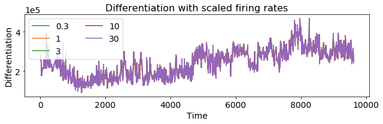
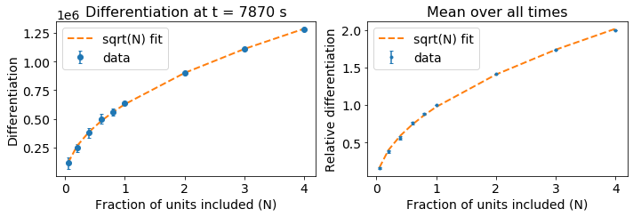
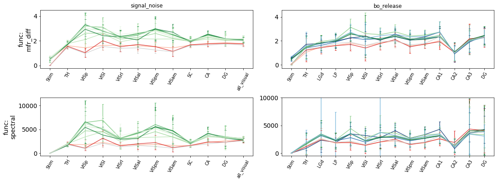
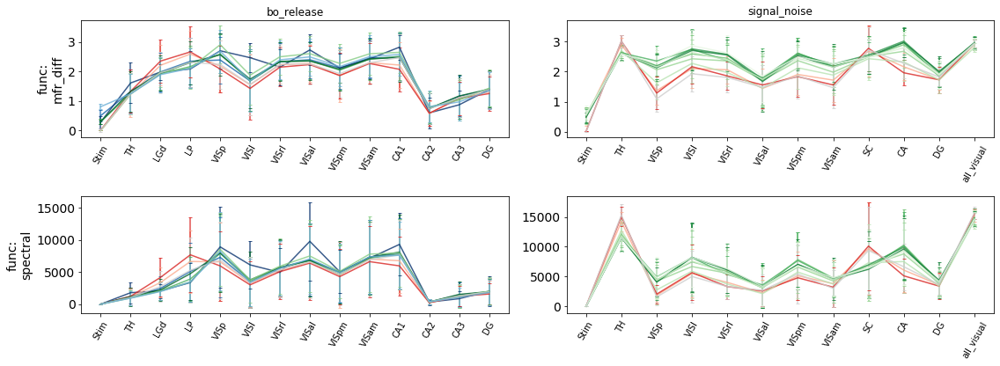
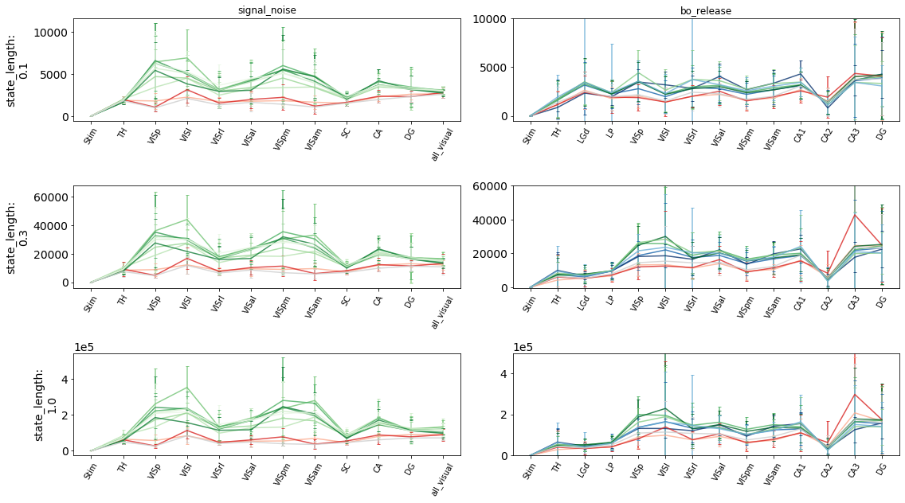
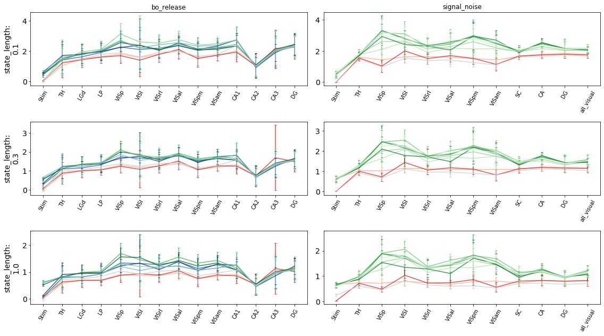
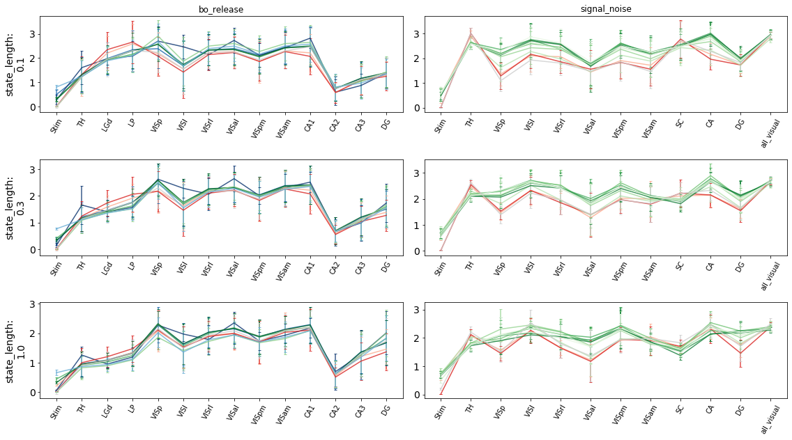
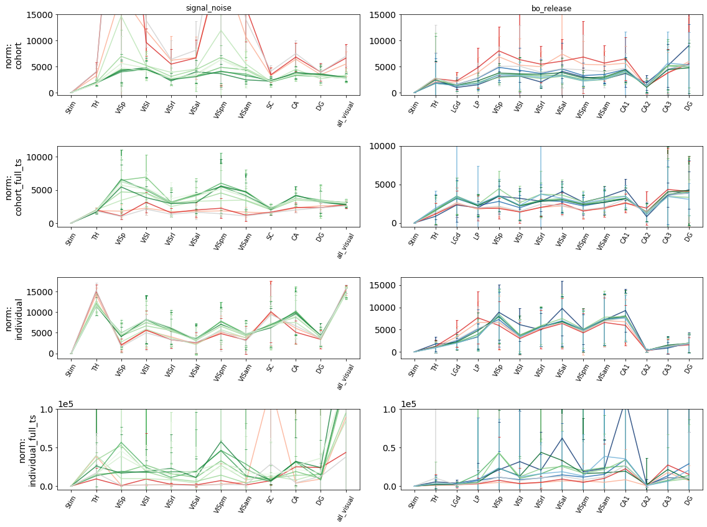

# Validate normalization
---

## Uniformly scaled firing rates

## Resample different fractions of units

# spectral vs mean_firing_rate
---

## Global norm
The figures are for normalization using the entire timeseries, and across all units

100ms long states, 3s differentiation window.

## Local norm
Normalization of individual units, local time

100ms long states, 3s differentiation window

# Timescales
---

## Spectral differentiation; global norm

## Mean firing differentiation; global norm

## Mean firing differentiation; local norm

# Normalization type
State length of 0.1s, spectral differentiation

