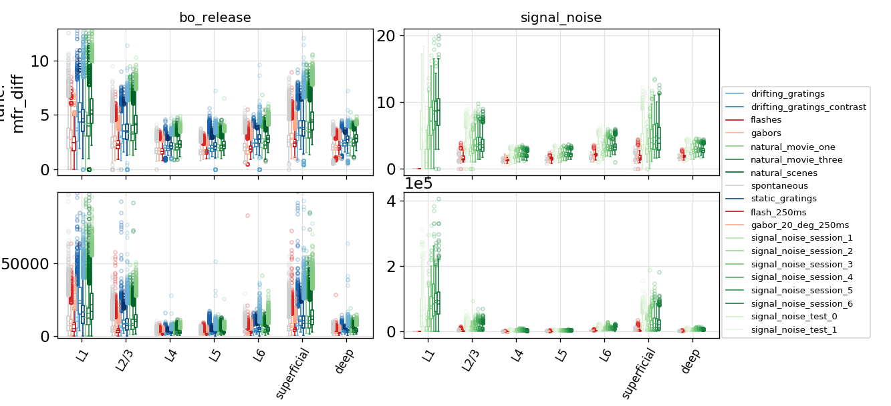
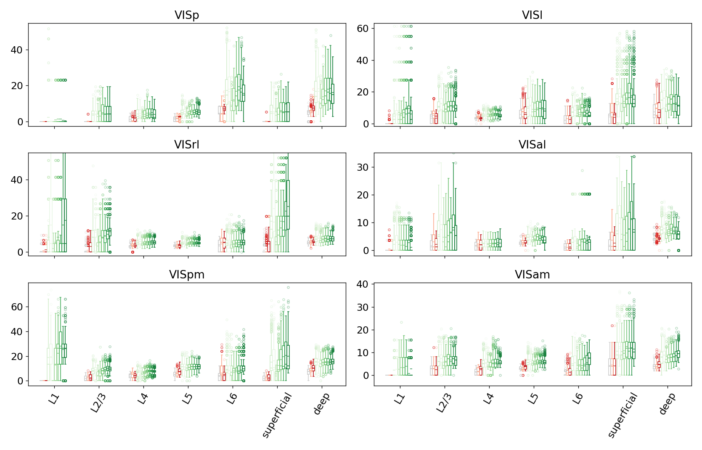
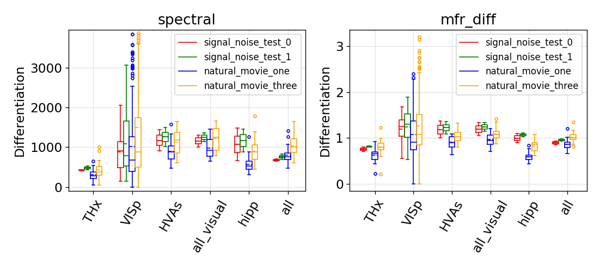

# Differentiation by layer and for averaged responses
---

## Units by layer (all regions clubbed together)
Global norm, 0.1s state window, 3s differentiation window, two differentiation metrics

All layers:

Summary superficial and deep layers:

* Differentiation in superficial layers is much higher than deep layers

## Separated by region and layer

* The general conclusion here is that when separated by region, the relationship between deep and superficial layers gets fuzzy.
* Superficial layers still have higher differentiation in most regions, but not in all.
* The differences are not consistent in Brain Observatory and Signal Noise datasets

### Brain observatory - full

### Brain observatory - zoomed

### Signal-Noise - full

### Signal-Noise - zoomed

## Differentiation in averaged responses

It is a little surprising that differentiation in the hippocampus is as high as visual areas (for simple as well as natural stimuli), even though hipp should not be affected by visual stimuli. One possibility is simply that the hippocampal neurons fire a lot (for other reasons), but this contributes to the differentiation. If that is the case, averaging the responses over repeats should not decrease diferentiation much in visual areas, but should decrease significantly in hipp. this is tested below:

### Regions summary

Without averaging responses:

After averaging responses:

The remaining plots below show layer wise differentiation of averaged responses, just because we have the data now. The trends are similar, but better separated between superficial and deep layers.

### Layers summary

### Layer x Region split

### All regions

## Additional figures

### Mean beyond whisker
