# Comparison of differentiation in CNNs and Neuropixel data
All data on this page is for differentiation calculated with a 0.1s state length, and 3s windows.

## Differentiation normalized to gabors vs spontaneous activity

### Does not make much difference for Neuropixel data
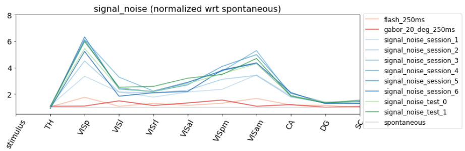
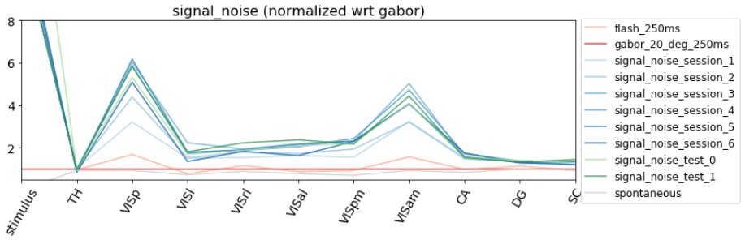

### But can still be tricky to interpret
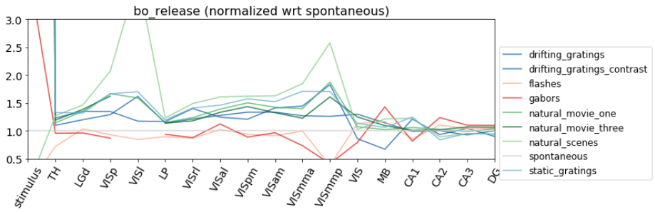
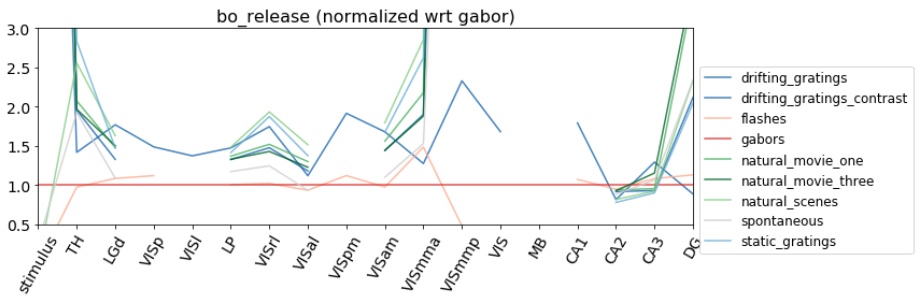

### Especially true for our CNNs
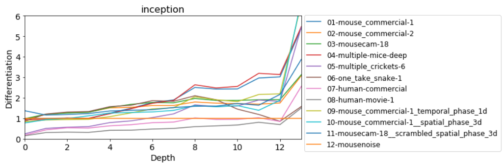
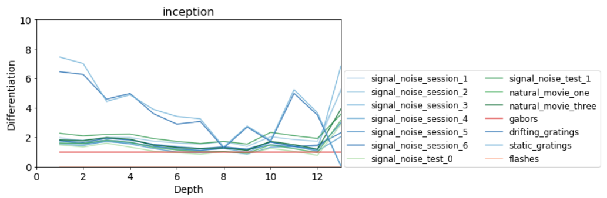

Also note how gratings have a very high differentiation in early layers compared to the rest of stimuli. This is consistent with the understanding that early layers encode edges. This can get quite dramatic:

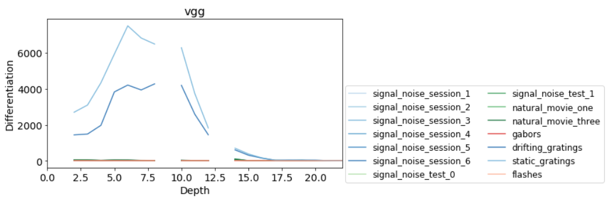

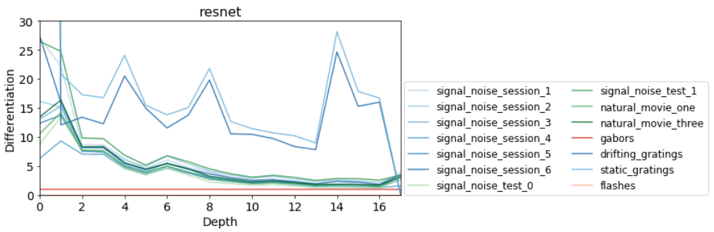

## SD vs ND in CNNs and Neuropixel data
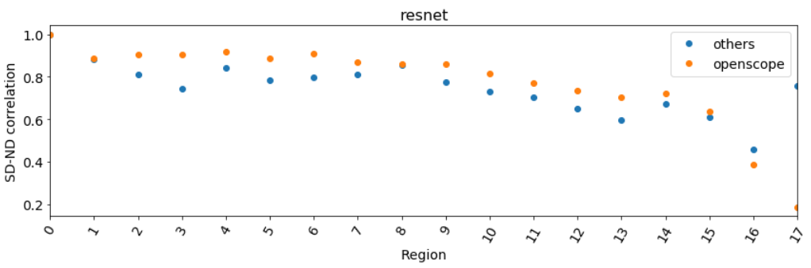
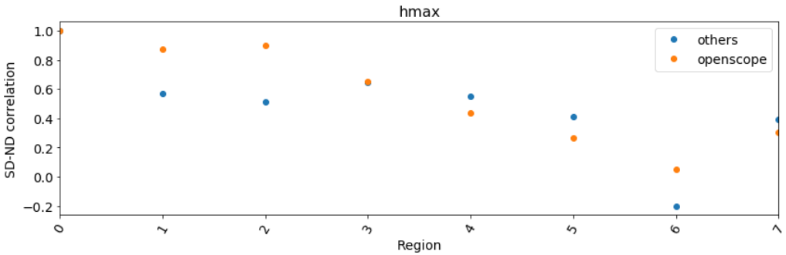
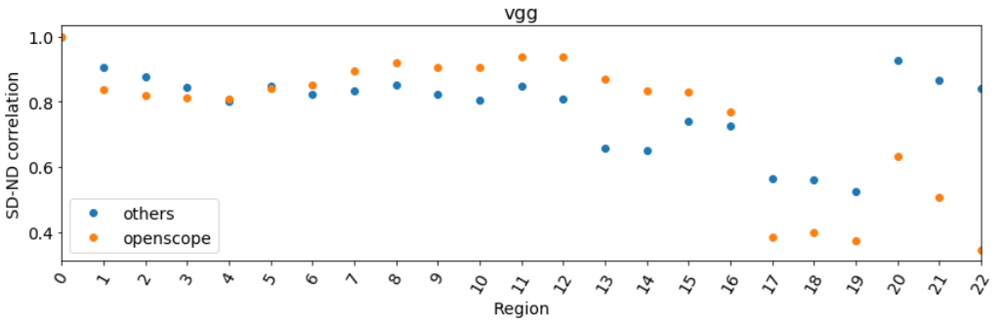

### Overall correlation is high in Npx data
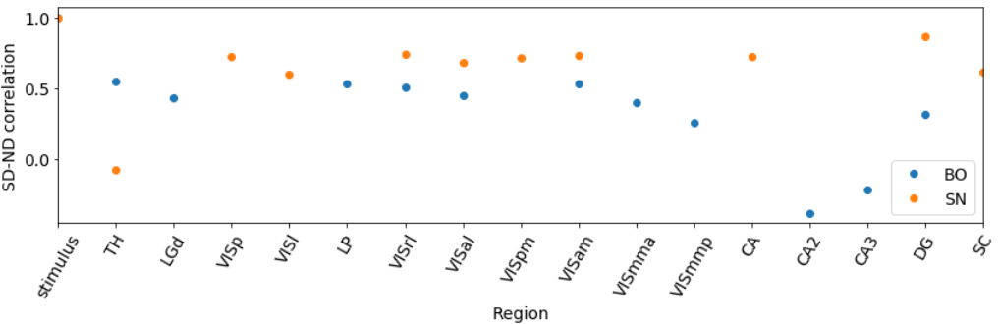

But this is because of the few extreme values in stimulus differentiation:
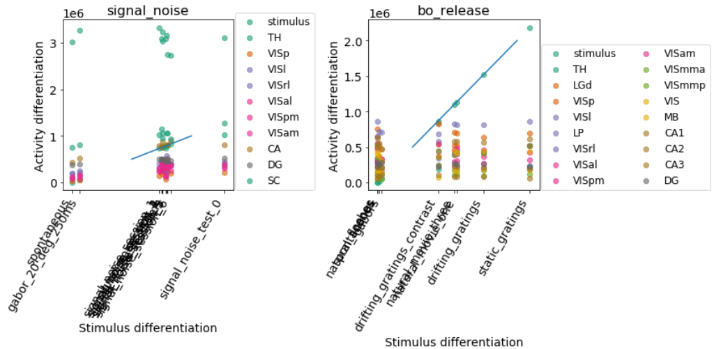

If we look only at the clustered regions:
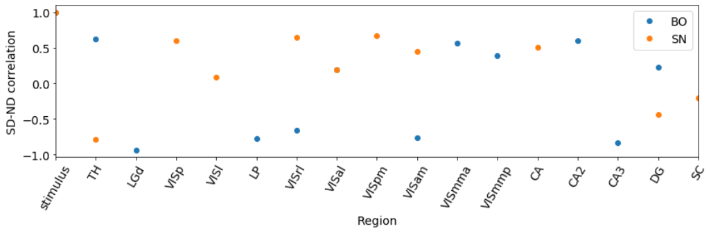